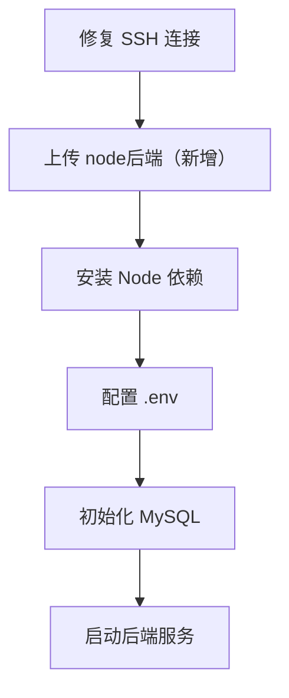

# DESIGN_backend_server_upload

## 1. 目标
- 将本地 `node后端（新增）` 上传到 Ubuntu 服务器，为后续部署做准备。

## 2. 预期实施路径

### 2.1 上传方式
- 首选：SSH + SFTP/PSCP
- 备用：
  - 面板文件上传
  - 控制台挂载下载
  - 压缩包中转上传

### 2.2 目标目录建议
- 建议服务器目录：
  - `/srv/vision/api`
- 上传内容：
  - 后端源码
  - `package.json`
  - 配置与脚本目录
  - 不上传本地 `node_modules`

### 2.3 后续部署链路

## 3. 当前设计阻塞
- 当前卡在 `A["修复 SSH 连接"]`
- 由于 SSH 服务未正常完成握手，上传链路无法向后推进
