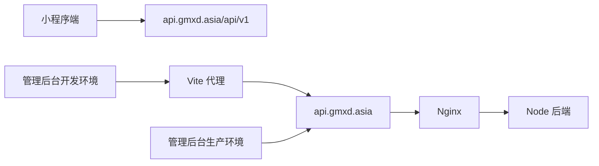

# DESIGN_client_api_switch_to_server

## 1. 设计目标
- 让小程序与管理后台统一指向已部署的服务器后端。
- 保持现有调用代码不变，只改配置层。

## 2. 配置设计

### 2.1 小程序端
- 文件：`小程序端/最终（视力）/miniprogram/app.js`
- 文件：`小程序端/最终（视力）/miniprogram/utils/request.js`
- 方案：
  - 将全局 `apiBaseUrl` 改为 `https://api.gmxd.asia/api/v1`
  - 将请求工具默认回退地址改为同一地址

### 2.2 管理后台
- 文件：`后台/art-lnb-master/.env.development`
- 文件：`后台/art-lnb-master/.env.production`
- 方案：
  - 开发环境继续使用 `/api` 代理，代理目标改为 `https://api.gmxd.asia`
  - 生产环境 API 基地址改为 `https://api.gmxd.asia`

## 3. 数据流

## 4. 风险控制
- 当前代码已切到 HTTPS 域名，真机调试前仍需完成小程序后台合法域名配置。
- 若后续切换正式主域名，需要同步改动这四个配置文件。
