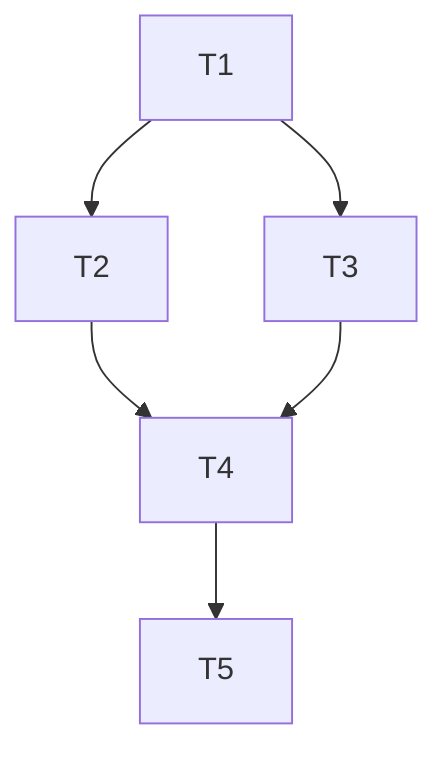

# TASK_client_api_switch_to_server

## 1. 原子任务拆分

| 任务ID | 任务 | 输入契约 | 输出契约 | 状态 |
| --- | --- | --- | --- | --- |
| T1 | 定位本地后端配置项 | 已存在项目代码 | 确认需要修改的文件清单 | 已完成 |
| T2 | 修改小程序基础 API 地址 | 小程序配置文件 | 小程序统一指向服务器后端 | 已完成 |
| T3 | 修改管理后台开发/生产 API 配置 | 后台环境变量文件 | 后台统一指向服务器后端 | 已完成 |
| T4 | 更新总说明文档与验收文档 | 前述任务完成 | 文档与代码状态一致 | 已完成 |
| T5 | 进行静态检查 | 已修改文件 | 确认无新增 lint 报错 | 已完成 |

## 2. 依赖关系

## 3. 实施约束
- 不改业务接口路径，仅改配置。
- 不在本次任务中处理后台服务器部署。
- 完成每项任务后同步更新文档。
