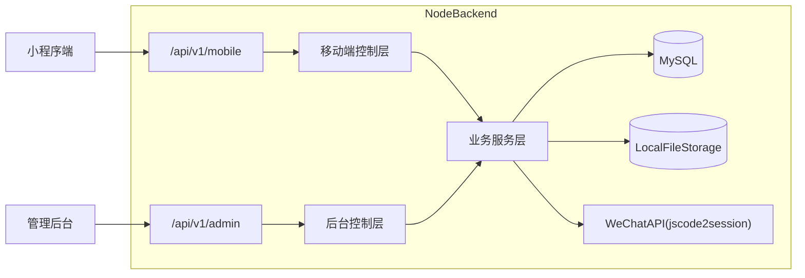
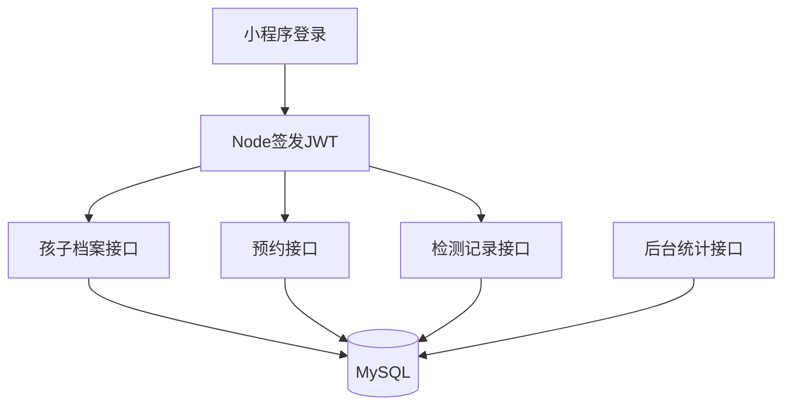

# DESIGN_云开发迁移到Node后端

## 一、整体设计

### 1.1 架构概览

### 1.2 分层设计

| 层级 | 说明 | 核心职责 |
| --- | --- | --- |
| 表现层 | 小程序端与管理后台 | 页面展示、交互、表单、状态管理 |
| 接口层 | Express Routes + Controllers | 鉴权、参数校验、响应封装 |
| 业务层 | Services | 业务规则、事务、聚合处理 |
| 数据层 | MySQL + 文件系统 | 持久化、索引、静态资源 |

### 1.3 当前结构与目标结构

#### 当前结构

- `小程序端/最终（视力）/miniprogram`：小程序前端
- `小程序端/最终（视力）/cloudfunctions`：微信云函数后端
- `后台/art-lnb-master`：Vue 管理后台前端
- `node后端（新增）`：已有 Express 骨架，但尚未承接实际业务

#### 目标结构

- `小程序端/最终（视力）/miniprogram`：改为 HTTP API 调用
- `后台/art-lnb-master`：改为 REST API 调用
- `node后端（新增）`：唯一后端，实现所有业务
- `小程序端/最终（视力）/cloudfunctions`：仅保留为迁移参考，不再扩展

## 二、多端 UI 规划

### 2.1 端清单

| 端 | 目标用户 | 访问方式 | 核心场景 |
| --- | --- | --- | --- |
| 小程序端 | 家长/普通用户 | 微信小程序 | 登录、档案、预约、检测记录 |
| 管理后台 | 管理员 | Web 后台 | 管理业务数据与查看统计 |

### 2.2 小程序端

#### 1. 定位

为家长提供儿童视力管理入口，强调操作简单、查看直观、移动端易用。

#### 2. UI 风格

- 风格关键词：医疗感、轻量、清晰、可信赖
- 视觉基调：浅色底、蓝色主色、卡片式信息布局
- 组件风格：表单与卡片并重，移动端大点击区

#### 3. 配色方案

| 类型 | 色值 | 用途 |
| --- | --- | --- |
| 主色 | `#0077C2` | 导航栏、主按钮、重点入口 |
| 辅色 | `#4DA3D9` | 标签、强调信息 |
| 背景色 | `#F6F6F6` | 页面背景 |
| 文本主色 | `#222222` | 标题、正文 |
| 成功色 | `#22C55E` | 成功提示 |
| 警告色 | `#F59E0B` | 风险提醒 |
| 错误色 | `#EF4444` | 错误提示 |

#### 4. 页面清单

| 页面 | 类型 | 目标 | 核心模块 | 备注 |
| --- | --- | --- | --- | --- |
| 登录页 | 核心页 | 登录/注册/协议确认 | 手机号登录、微信登录、协议弹窗 | 保留原能力 |
| 首页 | 核心页 | 展示轮播与当前孩子信息 | 轮播图、快捷入口、孩子卡片 | 替换图片来源 |
| 预约列表 | 核心页 | 查看预约项目 | 项目卡片、项目图片、入口跳转 | 改为 REST |
| 预约下单 | 核心页 | 选择排班并提交预约 | 时段列表、确认提交 | 保留同一孩子限制 |
| 数据页 | 核心页 | 查看检测趋势和当前记录 | 当前记录、对比记录、趋势展示 | 改为 REST |
| 历史记录页 | 列表页 | 查看历史检测记录 | 记录列表、详情跳转 | 保持现有交互 |
| 档案编辑页 | 表单页 | 新增/编辑孩子档案 | 基础信息、体征、头像上传 | 上传改为本地文件 |
| 孩子选择页 | 功能页 | 切换当前孩子 | 孩子列表、选择逻辑 | 保留多孩子模式 |
| 我的页面 | 核心页 | 查看用户信息与快捷入口 | 用户信息、我的预约、档案入口 | 保持结构不变 |
| 我的预约页 | 列表页 | 查看已预约记录 | 列表、状态展示 | 保留原能力 |

#### 5. 页面关系

- 登录页 → 孩子选择页 → 首页
- 首页 → 预约列表 → 预约下单
- 首页 → 数据页 → 历史记录页
- 首页 → 档案编辑页
- 首页 → 我的页面 → 我的预约页

#### 6. 关键交互与状态

- 空状态：无孩子档案、无预约、无检测记录
- 加载状态：页面初次进入和下拉刷新
- 错误状态：接口异常、登录失败、上传失败
- 权限不足状态：管理员功能不在小程序端暴露

### 2.3 管理后台

#### 1. 定位

为管理员提供统一业务管理入口，强调信息密集、操作高效、可检索可维护。

#### 2. UI 风格

- 风格关键词：后台管理、清晰、稳定、数据导向
- 视觉基调：白底深字、蓝色强调、表格与表单主导
- 组件风格：表格 CRUD、弹窗编辑、筛选检索

#### 3. 配色方案

| 类型 | 色值 | 用途 |
| --- | --- | --- |
| 主色 | `#1677FF` | 菜单高亮、主操作按钮 |
| 辅色 | `#13C2C2` | 图表辅助色、标签强调 |
| 背景色 | `#F5F7FA` | 页面背景 |
| 文本主色 | `#1F2329` | 标题、正文 |
| 成功色 | `#52C41A` | 启用/成功状态 |
| 警告色 | `#FAAD14` | 提醒、待处理状态 |
| 错误色 | `#FF4D4F` | 删除/错误状态 |

#### 4. 页面清单

| 页面 | 类型 | 目标 | 核心模块 | 备注 |
| --- | --- | --- | --- | --- |
| 管理员登录 | 核心页 | 管理员身份认证 | 手机号、密码登录 | 替换 CloudBase 网关 |
| 用户管理 | 列表页 | 管理用户信息与管理员标记 | 列表、搜索、编辑、启停、设管理员 | 保留表格结构 |
| 孩子档案 | 列表页 | 管理孩子档案 | 搜索、详情、编辑、删除 | 保留条件筛选 |
| 学校/班级字典 | 字典页 | 管理学校和班级 | 列表、增删改、启停 | 直接映射字典表 |
| 首页轮播管理 | 内容页 | 管理轮播图 | 上传、排序、启停 | 图片改为本地上传 |
| 协议与隐私 | 内容页 | 维护系统协议文本 | 富文本/文本编辑、保存 | 直接映射配置表 |
| 预约项目 | 列表页 | 管理预约项目 | 新增、编辑、上下架 | 图片改为本地上传 |
| 预约排班 | 列表页 | 管理排班与容量 | 列表、筛选、编辑、启停 | 保留容量字段 |
| 预约记录 | 列表页 | 查看与更新预约状态 | 列表、详情、状态修改 | 保留状态枚举 |
| 检测记录 | 列表页 | 查看与维护检测记录 | 搜索、创建、编辑、删除 | 保留 JSON 字段 |
| 仪表盘 | 概览页 | 展示统计数据 | 卡片、图表、动态列表 | 数据来源改为 MySQL 聚合 |

#### 5. 页面关系

- 登录页 → 仪表盘
- 仪表盘 → 用户管理 / 孩子档案 / 学校班级
- 仪表盘 → 轮播图 / 协议与隐私
- 仪表盘 → 预约项目 / 预约排班 / 预约记录
- 仪表盘 → 检测记录

#### 6. 关键交互与状态

- 空状态：无数据时显示表格空态
- 加载状态：表格加载、弹窗提交
- 错误状态：接口失败、上传失败、保存失败
- 权限不足状态：非管理员访问直接拒绝

## 三、后端规划

### 3.1 模块划分

| 模块 | 职责 | 关联端 |
| --- | --- | --- |
| auth | 小程序登录、微信登录、后台登录 | 全端 |
| users | 用户资料、用户管理 | 小程序端/后台 |
| children | 孩子档案、孩子搜索、切换 | 小程序端/后台 |
| school-classes | 学校班级字典 | 小程序端/后台 |
| banners | 首页轮播图 | 小程序端/后台 |
| system-config | 协议与隐私配置 | 小程序端/后台 |
| appointment-items | 预约项目 | 小程序端/后台 |
| appointment-schedules | 预约排班 | 小程序端/后台 |
| appointment-records | 预约记录与状态管理 | 小程序端/后台 |
| checkup-records | 检测记录 | 小程序端/后台 |
| analytics | 埋点与统计 | 小程序端/后台 |
| storage | 文件上传与静态访问 | 全端 |

### 3.2 API 规范

- Base URL：
  - 小程序端：`/api/v1/mobile`
  - 管理后台：`/api/v1/admin`
- 鉴权方式：`Authorization: Bearer <token>`
- 返回结构：
  - `code`
  - `message`
  - `data`
  - `timestamp`

### 3.3 API 清单

| 模块 | 接口名称 | Method | API 地址 | 鉴权 | 用途 |
| --- | --- | --- | --- | --- | --- |
| 移动端认证 | 手机号登录 | POST | `/api/v1/mobile/auth/login` | 否 | 手机号登录 |
| 移动端认证 | 微信登录 | POST | `/api/v1/mobile/auth/wechat-login` | 否 | 微信快捷登录 |
| 移动端认证 | 注册 | POST | `/api/v1/mobile/auth/register` | 否 | 注册用户 |
| 移动端用户 | 获取当前用户 | GET | `/api/v1/mobile/user/profile` | 是 | 获取用户信息 |
| 移动端孩子 | 获取孩子列表 | GET | `/api/v1/mobile/children` | 是 | 获取当前用户孩子列表 |
| 移动端孩子 | 新增孩子 | POST | `/api/v1/mobile/children` | 是 | 新建档案 |
| 移动端孩子 | 更新孩子 | PUT | `/api/v1/mobile/children/:id` | 是 | 编辑档案 |
| 移动端孩子 | 删除孩子 | DELETE | `/api/v1/mobile/children/:id` | 是 | 删除档案 |
| 移动端预约 | 获取预约项目 | GET | `/api/v1/mobile/appointments/items` | 是 | 查询项目 |
| 移动端预约 | 获取排班 | GET | `/api/v1/mobile/appointments/schedules` | 是 | 查询排班 |
| 移动端预约 | 提交预约 | POST | `/api/v1/mobile/appointments/bookings` | 是 | 下单预约 |
| 移动端预约 | 我的预约 | GET | `/api/v1/mobile/appointments/bookings` | 是 | 查询预约记录 |
| 移动端检测 | 获取记录列表 | GET | `/api/v1/mobile/checkups` | 是 | 查询检测记录 |
| 移动端检测 | 获取记录详情 | GET | `/api/v1/mobile/checkups/:id` | 是 | 详情 |
| 移动端检测 | 新建记录 | POST | `/api/v1/mobile/checkups` | 是 | 新增记录 |
| 移动端检测 | 更新记录 | PUT | `/api/v1/mobile/checkups/:id` | 是 | 更新记录 |
| 移动端内容 | 获取轮播图 | GET | `/api/v1/mobile/content/banners` | 否/是 | 首页轮播 |
| 移动端内容 | 获取协议 | GET | `/api/v1/mobile/content/terms` | 否/是 | 协议与隐私 |
| 后台认证 | 管理员登录 | POST | `/api/v1/admin/auth/login` | 否 | 后台登录 |
| 后台用户 | 用户列表 | GET | `/api/v1/admin/users` | 是 | 用户管理 |
| 后台用户 | 编辑用户 | PUT | `/api/v1/admin/users/:id` | 是 | 更新用户 |
| 后台孩子 | 孩子列表 | GET | `/api/v1/admin/children` | 是 | 孩子档案管理 |
| 后台学校班级 | 列表 | GET | `/api/v1/admin/school-classes` | 是 | 字典管理 |
| 后台轮播图 | CRUD | REST | `/api/v1/admin/banners` | 是 | 轮播图管理 |
| 后台预约项目 | CRUD | REST | `/api/v1/admin/appointment-items` | 是 | 项目管理 |
| 后台预约排班 | CRUD | REST | `/api/v1/admin/appointment-schedules` | 是 | 排班管理 |
| 后台预约记录 | 列表/改状态 | GET/PUT | `/api/v1/admin/appointment-records` | 是 | 记录管理 |
| 后台检测记录 | CRUD | REST | `/api/v1/admin/checkup-records` | 是 | 检测记录管理 |
| 后台系统配置 | 获取/更新协议 | GET/PUT | `/api/v1/admin/system-config/terms` | 是 | 协议配置 |
| 后台统计 | 仪表盘数据 | GET | `/api/v1/admin/dashboard/stats` | 是 | 统计展示 |
| 文件上传 | 上传图片 | POST | `/api/v1/common/upload/image` | 是 | 上传头像/轮播图/项目图 |

### 3.4 请求响应字段模板

| 接口 | 请求核心字段 | 响应核心字段 | 备注 |
| --- | --- | --- | --- |
| `/api/v1/mobile/auth/login` | `phone` `password` | `token` `user` | 手机号登录 |
| `/api/v1/mobile/auth/wechat-login` | `code` | `token` `user` | 微信快捷登录 |
| `/api/v1/mobile/children` | `name` `gender` `parent_phone` | `child` | 新增档案 |
| `/api/v1/mobile/appointments/bookings` | `schedule_id` `child_id` | `booking` | 预约创建 |
| `/api/v1/admin/auth/login` | `phone` `password` | `token` `admin` | 后台登录 |
| `/api/v1/admin/banners` | `image_url` `title` `order` | `banner` | 轮播图管理 |

### 3.5 错误码规划

| 错误码 | 含义 | 处理方式 |
| --- | --- | --- |
| 40001 | 参数错误 | 前端提示并阻止提交 |
| 40101 | 未登录或 token 无效 | 跳转登录 |
| 40301 | 无权限 | 展示权限提示 |
| 40401 | 数据不存在 | 提示并刷新页面 |
| 40901 | 数据冲突 | 前端展示冲突原因 |
| 42201 | 表单校验失败 | 字段级错误提示 |
| 50001 | 服务器内部错误 | 统一错误提示 |

## 四、MySQL 规划

### 4.1 数据库信息

| 项 | 内容 |
| --- | --- |
| 数据库名 | `vision_management` |
| 字符集 | `utf8mb4` |
| 排序规则 | `utf8mb4_unicode_ci` |

### 4.2 库表清单

| 表名 | 用途 | 主键 | 关键字段 | 索引建议 |
| --- | --- | --- | --- | --- |
| `users` | 用户与管理员信息 | `id` | `phone` `password_hash` `wechat_openid` `is_admin` `status` | `uk_phone` `uk_wechat_openid` |
| `children` | 孩子档案 | `id` | `user_id` `name` `child_no` `parent_phone` `school` `class_name` | `idx_user_id` `uk_child_no` |
| `school_classes` | 学校班级字典 | `id` | `school` `class_name` `active` | `uk_school_class` |
| `banners` | 首页轮播图 | `id` | `image_url` `title` `sub_title` `sort_order` `active` | `idx_sort_order` |
| `system_configs` | 系统配置 | `id` | `config_key` `config_value` | `uk_config_key` |
| `appointment_items` | 预约项目 | `id` | `name` `image_url` `active` | `idx_active_name` |
| `appointment_schedules` | 预约排班 | `id` | `item_id` `schedule_date` `time_slot` `max_count` `booked_count` `active` | `idx_item_date` |
| `appointment_records` | 预约记录 | `id` | `user_id` `child_id` `schedule_id` `status` `phone` | `idx_child_id` `idx_schedule_id` `idx_status` |
| `checkup_records` | 检测记录 | `id` | `child_id` `checkup_date` `vision_l` `vision_r` `refraction_l_json` `refraction_r_json` `diagnosis_json` | `idx_child_date` |
| `analytics_events` | 行为事件 | `id` | `user_id` `event_type` `event_name` `page_path` | `idx_event_type_created` |
| `analytics_visitors` | 在线访客快照 | `id` | `user_id` `visitor_key` `last_seen_at` | `idx_last_seen_at` |
| `uploads` | 文件元数据 | `id` | `biz_type` `file_name` `file_path` `url` | `idx_biz_type` |

### 4.3 关系说明

- `users` 1:N `children`
- `appointment_items` 1:N `appointment_schedules`
- `children` 1:N `appointment_records`
- `children` 1:N `checkup_records`
- `users` 1:N `appointment_records`
- `users` 1:N `analytics_events`

### 4.4 检测记录字段设计

- `refraction_l_json`：JSON，保存左眼球镜/柱镜/轴位
- `refraction_r_json`：JSON，保存右眼球镜/柱镜/轴位
- `diagnosis_json`：JSON，保存视力状态、屈光状态、轴位状态、角膜状态

## 五、数据流与异常处理

### 5.1 核心数据流

### 5.2 前端异常

- 统一对 401 做重新登录处理
- 统一对 403 做权限提示
- 上传失败时保留表单数据并提示重试
- 小程序弱网情况下保留基础空态和失败兜底

### 5.3 接口异常

- 统一返回标准错误结构
- 参数校验失败返回 422
- 业务冲突返回 409
- 未登录返回 401
- 无权限返回 403

### 5.4 数据异常

- 预约创建使用事务，保证 `booked_count` 与预约记录一致
- 删除与状态修改需校验关联数据存在性
- 微信上传/登录等外部接口失败时记录日志并返回明确错误

## 六、结构收敛策略

1. 以后端根目录结构为主，不再继续维护 `node后端（新增）/src` 平行骨架。
2. 所有业务新代码统一落在根层约定目录中，例如 `routes`、`controllers`、`services`、`models`、`scripts`、`utils`。
3. 原 `src` 中仅保留必要历史参考，逐步停止引用。
