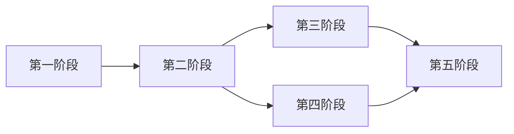

# TASK_云开发迁移到Node后端

## 一、阶段拆分总览

| 阶段 | 目标 | 主要交付物 | 依赖 |
| --- | --- | --- | --- |
| 第一阶段 | 建立文档与迁移映射 | `说明文档.md`、`ALIGNMENT`、`CONSENSUS`、`DESIGN`、`TASK` | 无 |
| 第二阶段 | 收敛 Node 后端骨架与基础设施 | 可启动的 Express + MySQL + JWT + 上传能力 | 第一阶段 |
| 第三阶段 | 迁移小程序端核心业务链路 | `/api/v1/mobile/*`、小程序 HTTP 封装与页面改造 | 第二阶段 |
| 第四阶段 | 迁移管理后台业务链路 | `/api/v1/admin/*`、后台 API 改造与图片能力替换 | 第二阶段 |
| 第五阶段 | 联调、清理和验收 | `ACCEPTANCE`、`FINAL`、`TODO`、联调结果 | 第三、四阶段 |

## 二、任务依赖图

## 三、阶段详情

### 第一阶段：文档对齐与迁移映射

#### 1. 阶段目标

建立统一文档体系，明确现状、目标架构、库表、接口、任务顺序与验收标准。

#### 2. 页面范围

| 端 | 页面/模块 | 说明 |
| --- | --- | --- |
| 全端 | 文档与规划 | 不涉及页面改造，输出执行输入 |

#### 3. 前端任务

- 梳理小程序端页面与后台页面清单
- 识别当前依赖 `wx.cloud.callFunction` 和 CloudBase 的位置
- 明确图片上传和展示依赖点

#### 4. 后端任务

- 梳理云函数 action 与 Node 模块映射
- 梳理 `node后端（新增）` 可复用骨架

#### 5. API 任务

| 接口/能力 | Method | 说明 |
| --- | --- | --- |
| 云函数 action 映射清单 | N/A | 明确到 REST API 的映射 |

#### 6. 数据库任务

| 表 | 任务 |
| --- | --- |
| 全表 | 完成表结构草案与关系说明 |

#### 7. 交付物

- `说明文档.md`
- `ALIGNMENT`
- `CONSENSUS`
- `DESIGN`
- `TASK`

#### 8. 验收标准

- 文档齐全
- 范围清晰
- 模块映射、API、数据库方案完整

#### 9. 风险与依赖

- 若范围或登录模式不清晰，会导致后续实现返工

### 第二阶段：Node 后端骨架与基础能力

#### 1. 阶段目标

让 `node后端（新增）` 具备唯一后端应有的基础设施：目录结构、MySQL、JWT、文件上传、健康检查、标准响应。

#### 2. 页面范围

| 端 | 页面/模块 | 说明 |
| --- | --- | --- |
| Node 后端 | 后端基础设施 | 无页面，侧重服务能力 |

#### 3. 前端任务

- 暂不改业务页面
- 准备后续前端切换所需的环境变量和接口前缀约定

#### 4. 后端任务

- 收敛 `node后端（新增）` 目录结构
- 新增 `controllers`、`services`、`models`、`uploads` 等目录
- 清理硬编码默认敏感配置
- 完成文件上传与静态资源路由
- 完成双端 JWT 鉴权中间件增强
- 完成数据库初始化脚本和种子数据脚本

#### 5. API 任务

| 接口 | Method | 说明 |
| --- | --- | --- |
| `/health` | GET | 健康检查 |
| `/api/v1/common/upload/image` | POST | 图片上传 |

#### 6. 数据库任务

| 表 | 任务 |
| --- | --- |
| `users` | 建表 |
| `children` | 建表 |
| `school_classes` | 建表 |
| `banners` | 建表 |
| `system_configs` | 建表 |
| `appointment_items` | 建表 |
| `appointment_schedules` | 建表 |
| `appointment_records` | 建表 |
| `checkup_records` | 建表 |
| `analytics_events` | 建表 |
| `analytics_visitors` | 建表 |
| `uploads` | 建表 |

#### 7. 交付物

- 可运行 Node 服务
- 可执行建库建表脚本
- 可上传图片并输出 URL

#### 8. 验收标准

- `npm run dev` 可启动
- 健康检查可访问
- 数据库可成功建表
- JWT 可区分移动端和后台端
- 图片可上传并通过 URL 访问

#### 9. 风险与依赖

- 依赖 MySQL 环境与 `.env` 配置
- 微信登录链路需要后续配置微信参数

### 第三阶段：小程序端核心业务迁移

#### 1. 阶段目标

将小程序端当前依赖云函数的核心链路全部切换到 Node 后端。

#### 2. 页面范围

| 端 | 页面 | 说明 |
| --- | --- | --- |
| 小程序端 | 登录页 | 手机号登录、微信快捷登录 |
| 小程序端 | 首页 | 轮播图、孩子信息 |
| 小程序端 | 孩子选择/档案编辑 | 孩子档案查询与维护 |
| 小程序端 | 预约页/我的预约 | 项目、排班、预约记录 |
| 小程序端 | 数据页/历史记录页 | 检测记录查询与维护 |

#### 3. 前端任务

- 新增 HTTP 请求封装与鉴权处理
- 替换所有 `wx.cloud.callFunction`
- 替换 `wx.cloud.downloadFile` 相关图片加载逻辑
- 对接新的登录返回结构和 token 管理

#### 4. 后端任务

- 实现移动端认证、用户、孩子、预约、检测记录、内容配置接口
- 实现微信登录 `code2session`
- 实现孩子与预约权限校验

#### 5. API 任务

| 接口 | Method | 说明 |
| --- | --- | --- |
| `/api/v1/mobile/auth/register` | POST | 注册 |
| `/api/v1/mobile/auth/login` | POST | 手机号登录 |
| `/api/v1/mobile/auth/wechat-login` | POST | 微信登录 |
| `/api/v1/mobile/user/profile` | GET | 当前用户信息 |
| `/api/v1/mobile/children` | GET/POST | 孩子列表/新增 |
| `/api/v1/mobile/children/:id` | PUT/DELETE | 编辑/删除孩子 |
| `/api/v1/mobile/appointments/items` | GET | 项目列表 |
| `/api/v1/mobile/appointments/schedules` | GET | 排班列表 |
| `/api/v1/mobile/appointments/bookings` | GET/POST | 我的预约/预约提交 |
| `/api/v1/mobile/checkups` | GET/POST | 检测记录列表/创建 |
| `/api/v1/mobile/checkups/:id` | GET/PUT | 详情/更新 |
| `/api/v1/mobile/content/banners` | GET | 轮播图 |
| `/api/v1/mobile/content/terms` | GET | 协议配置 |

#### 6. 数据库任务

| 表 | 任务 |
| --- | --- |
| `users` | 支持手机号与微信 openid 登录 |
| `children` | 支持按用户关联档案 |
| `appointment_*` | 支持排班与预约链路 |
| `checkup_records` | 支持 JSON 诊断数据 |
| `banners`/`system_configs` | 支持首页与协议读取 |

#### 7. 交付物

- 小程序端 HTTP 调用能力
- `/api/v1/mobile/*` 接口
- 小程序完整业务链路可用

#### 8. 验收标准

- 小程序不再依赖云函数
- 登录、档案、预约、记录链路可跑通
- 图片可从新后端正确加载

#### 9. 风险与依赖

- 微信登录依赖微信小程序配置
- 多孩子与用户归属判断需要与原业务一致

### 第四阶段：管理后台业务迁移

#### 1. 阶段目标

将后台管理能力从 `admin_manager` 云函数迁移为标准管理后台 REST 接口，并改造后台前端调用。

#### 2. 页面范围

| 端 | 页面 | 说明 |
| --- | --- | --- |
| 管理后台 | 登录页 | 管理员登录 |
| 管理后台 | 仪表盘 | 基础统计 |
| 管理后台 | 用户管理 | 列表、编辑、设管理员 |
| 管理后台 | 孩子档案 | 列表、搜索、编辑 |
| 管理后台 | 学校/班级字典 | CRUD |
| 管理后台 | 轮播图 | CRUD、上传 |
| 管理后台 | 协议与隐私 | 配置维护 |
| 管理后台 | 预约项目/排班/记录 | CRUD 和状态修改 |
| 管理后台 | 检测记录 | CRUD |

#### 3. 前端任务

- 替换 `src/api/vision-admin.ts` 中的 CloudBase 网关调用
- 替换 CloudBase 图片上传与临时 URL 解析逻辑
- 确认后台鉴权和 token 持久化逻辑

#### 4. 后端任务

- 实现后台认证接口
- 实现后台用户、孩子、字典、内容、预约、检测记录、统计接口
- 实现后台图片上传能力

#### 5. API 任务

| 接口 | Method | 说明 |
| --- | --- | --- |
| `/api/v1/admin/auth/login` | POST | 管理员登录 |
| `/api/v1/admin/users` | GET/POST | 用户列表/创建 |
| `/api/v1/admin/users/:id` | GET/PUT/DELETE | 用户详情/编辑/删除 |
| `/api/v1/admin/users/:id/admin` | PUT | 设置管理员 |
| `/api/v1/admin/children` | GET/POST | 孩子列表/创建 |
| `/api/v1/admin/children/:id` | GET/PUT/DELETE | 孩子维护 |
| `/api/v1/admin/school-classes` | GET/POST | 学校班级字典 |
| `/api/v1/admin/school-classes/:id` | PUT/DELETE | 字典维护 |
| `/api/v1/admin/banners` | REST | 轮播图管理 |
| `/api/v1/admin/appointment-items` | REST | 预约项目管理 |
| `/api/v1/admin/appointment-schedules` | REST | 预约排班管理 |
| `/api/v1/admin/appointment-records` | GET | 预约记录列表 |
| `/api/v1/admin/appointment-records/:id/status` | PUT | 修改预约状态 |
| `/api/v1/admin/checkup-records` | REST | 检测记录管理 |
| `/api/v1/admin/system-config/terms` | GET/PUT | 协议配置 |
| `/api/v1/admin/dashboard/stats` | GET | 统计面板 |

#### 6. 数据库任务

| 表 | 任务 |
| --- | --- |
| `users` | 支持后台管理员过滤 |
| `school_classes` | 支持后台字典管理 |
| `banners` | 支持排序和上下架 |
| `appointment_*` | 支持后台管理与分页筛选 |
| `checkup_records` | 支持后台按孩子/日期/学校筛选 |
| `analytics_*` | 支持仪表盘统计 |

#### 7. 交付物

- 后台 `/api/v1/admin/*` 接口
- 后台前端 API 改造完成
- 图片上传/预览替换完成

#### 8. 验收标准

- 管理后台不再依赖 CloudBase 网关
- 所有核心菜单可正常使用
- 后台图片上传与预览可用

#### 9. 风险与依赖

- 管理后台字段映射较多，需严格保持接口兼容
- 仪表盘统计需要聚合 SQL，注意性能与正确性

### 第五阶段：联调、清理与验收交付

#### 1. 阶段目标

完成全链路联调，移除业务上的云开发依赖，补齐验收和交付文档。

#### 2. 页面范围

| 端 | 页面/模块 | 说明 |
| --- | --- | --- |
| 小程序端 | 全量关键页面 | 回归测试 |
| 管理后台 | 全量核心菜单 | 回归测试 |
| Node 后端 | 全模块 | 联调与日志校验 |

#### 3. 前端任务

- 回归登录、上传、列表、编辑、删除、状态切换
- 清理无效云开发配置和调用残留

#### 4. 后端任务

- 清理已废弃的云开发兼容逻辑
- 完善日志和错误提示
- 输出初始化说明与联调说明

#### 5. API 任务

| 接口 | Method | 说明 |
| --- | --- | --- |
| 全量接口 | 全量 | 完成联调与验收 |

#### 6. 数据库任务

| 表 | 任务 |
| --- | --- |
| 全表 | 校验建表、索引、种子数据与真实联调数据一致性 |

#### 7. 交付物

- `ACCEPTANCE_云开发迁移到Node后端.md`
- `FINAL_云开发迁移到Node后端.md`
- `TODO_云开发迁移到Node后端.md`
- 最新 `说明文档.md`

#### 8. 验收标准

- 项目在本地 MySQL 环境下可独立运行
- 小程序与后台均可通过新后端完成核心业务
- 不再依赖云函数作为业务主入口
- 文档、代码、配置保持一致

#### 9. 风险与依赖

- 若发现业务与云函数逻辑不一致，需要补齐回归修正

## 四、默认假设与处理规则

### 4.1 默认假设

- 首版文件存储使用本地目录
- 首版不启用复杂缓存与分布式会话
- 首版维持 `is_admin` 管理员标记

### 4.2 中断条件

- 微信登录官方参数缺失且无法验证
- MySQL 环境不可用
- 出现影响核心业务边界的新增需求
