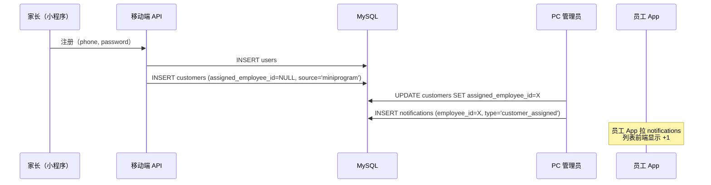
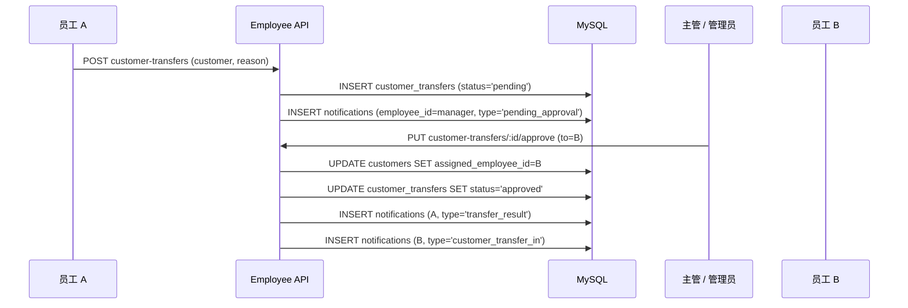
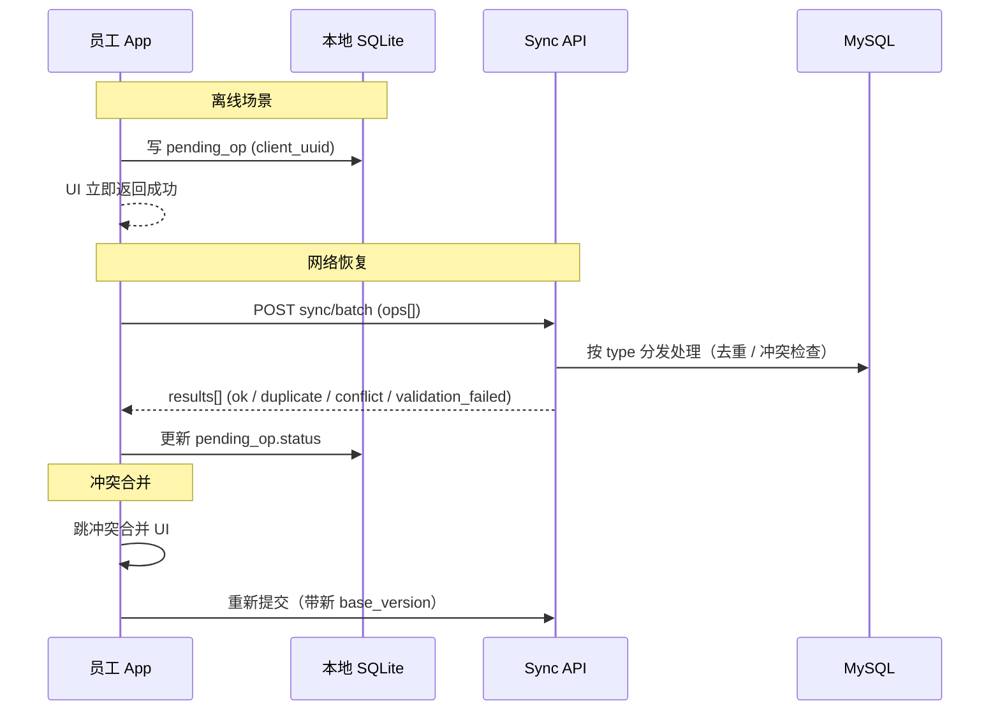

# DESIGN_员工app

## 一、整体设计

### 1.1 架构概览

```mermaid
flowchart LR
    subgraph clients [客户端]
      employeeApp[员工 App<br/>UniApp APK + H5]
      adminWeb[PC 管理后台<br/>Vue3]
      miniProgram[家长端小程序]
    end

    subgraph nginx [Nginx]
      proxy[/api/ 反代]
    end

    employeeApp --> proxy
    adminWeb --> proxy
    miniProgram --> proxy

    subgraph nodeBackend [vision-server (Node 3100)]
      proxy --> employeeRoutes["/api/v1/employee/*"]
      proxy --> adminRoutes["/api/v1/admin/*"]
      proxy --> mobileRoutes["/api/v1/mobile/*"]
      employeeRoutes --> employeeServices[Employee Services]
      adminRoutes --> sharedServices[Shared Services]
      mobileRoutes --> sharedServices
      employeeServices --> mysql[(MySQL<br/>vision_management)]
      sharedServices --> mysql
      employeeServices --> upload[(local uploads/)]
      employeeServices --> sms[SMS Provider]
    end
```

### 1.2 分层设计

| 层级 | 说明 | 核心职责 |
| --- | --- | --- |
| 表现层 | 员工 App（UniApp） + PC 后台 + 小程序 | 页面展示、交互、表单、状态管理、本地缓存、离线队列 |
| 接入层 | Nginx | 反代、HTTPS、限流（v1.1） |
| 接口层 | Express Routes + 中间件 | 鉴权、参数校验、响应封装、审计、限流 |
| 业务层 | Services | 业务规则、事务、聚合处理、外部 API（SMS / wechat） |
| 数据层 | MySQL + 本地文件 | 持久化、索引、审计日志、上传文件 |

### 1.3 当前结构与目标结构

#### 当前结构（已有）

```
/www/shi-li/
├── 小程序端/最终（视力）/        # 家长端 UniApp / 小程序
├── 后台/art-lnb-master/          # Vue3 管理后台
├── node后端（新增）/              # Express + MySQL
└── docs/                         # 项目文档
```

#### 目标结构（新增）

```
/www/shi-li/
├── 员工App/                      # 【新】UniApp 工程，输出 APK + H5
│   ├── manifest.json
│   ├── pages.json
│   ├── pages/
│   ├── stores/
│   ├── api/
│   ├── db/                       # 本地 SQLite schema + repo
│   └── utils/
├── 后台/art-lnb-master/src/views/vision-admin/
│   ├── employees/                # 【新】员工管理页
│   ├── departments/              # 【新】部门管理页
│   ├── customers/                # 【新】客户全局视图
│   ├── customer-transfers/       # 【新】转出审批
│   ├── customer-tags/            # 【新】标签字典
│   └── system-announcements/     # 【新】公告管理
├── node后端（新增）/
│   ├── routes/employee/          # 【新】员工接口子树
│   ├── services/                 # 新增 employeeService 等 6 个
│   └── scripts/db/core.js        # 增量加 10 张新表
└── docs/员工app/                  # 【新】本套文档
```

---

## 二、多端 UI 规划

### 2.1 端清单

| 端 | 目标用户 | 访问方式 | 核心场景 |
| --- | --- | --- | --- |
| 员工 App | 一线员工 / 部门主管 | UniApp APK + H5 | 客户管理、跟进、转出申请、消息查看 |
| PC 管理后台（既有 + 新页） | 系统管理员 + 部门主管 | Web 后台 | 员工 / 部门 / 客户全局管理、转出审批、公告发布 |

### 2.2 员工 App

#### 1. 定位

为内部员工提供随身的客户管理工具，**强调速度（点拨号即拨）+ 离线容忍（地铁里也能写）+ 权限隔离（只看自己客户）**。

#### 2. UI 风格

- 风格关键词：商务、利落、信息密集、可信赖
- 视觉基调：白底 + 蓝色主色调，不抢眼
- 组件风格：列表卡片为主，表单分步、按钮区域大方便点按

#### 3. 配色方案

| 类型 | 色值 | 用途 |
| --- | --- | --- |
| 主色 | `#1677FF` | 头部、主按钮、进度条 |
| 辅色 | `#13C2C2` | 标签、强调信息 |
| 背景色 | `#F5F7FA` | 页面背景 |
| 文本主色 | `#1F2329` | 标题、正文 |
| 成功色 | `#52C41A` | 已签到 / 已审批通过 |
| 警告色 | `#FAAD14` | 待跟进 / 待审批 |
| 错误色 | `#FF4D4F` | 已流失 / 已驳回 |

#### 4. 页面清单

| 页面 | 路径 | 类型 | 目标 | 核心模块 | 备注 |
| --- | --- | --- | --- | --- | --- |
| 登录页 | `pages/login/index` | 核心页 | 手机号 + 密码登录 | 表单、忘记密码、首登改密入口 | |
| 首登改密页 | `pages/login/change-password` | 核心页 | 强制改初始密码 | 旧密码 + 新密码（≥8） | must_change_password=1 时进入 |
| 异地登录验证页 | `pages/login/verify` | 核心页 | 短信验证码二次校验 | 验证码 + 重新发送计时 | |
| 工作台 | `pages/home/index` | 核心页 | 4 快捷入口 + 4 数据卡 + 公告 | 数据卡片、公告列表 | 角色感知布局 |
| 客户列表 | `pages/customer/list` | 列表页 | 看自己名下客户 | 筛选、排序、列表项、长按菜单 | 拨号 / 改 / 转出 |
| 客户详情 | `pages/customer/detail` | 详情页 | 4 个 Tab：基本 / 跟进 / 档案 / 提醒 | Tab、写跟进入口、转出按钮 | |
| 新增客户 | `pages/customer/new` | 表单页 | 临时建档 | 必填字段表单 | |
| 编辑客户 | `pages/customer/edit` | 表单页 | 改基本信息 | 表单 | 自动同步小程序 |
| 全局搜索 | `pages/customer/search` | 功能页 | 跨客户搜手机号 / 姓名 | 输入框、命中列表 | 限自己名下 |
| 跟进列表 | `pages/follow-up/list` | 列表页 | 看所有跟进 | 时间线、筛选 | |
| 写跟进 | `pages/follow-up/new` | 表单页 | 结构化字段 + 附件 | 类型 / 结果 / 内容 / 附件 / 下次提醒 | |
| 跟进详情 | `pages/follow-up/detail` | 详情页 | 看完整记录 | 内容、附件、改 / 删 | 仅自己创建可改删 |
| 提交转出 | `pages/transfer/new` | 表单页 | 客户转出申请 | 转出原因、备注 | |
| 我提交的转出 | `pages/transfer/mine` | 列表页 | 看自己提交的申请状态 | 列表、进度 | |
| 待审批（manager） | `pages/transfer/pending` | 列表页 | 主管审批转出申请 | 通过 / 驳回 / 选目标员工 | manager 专属 |
| 消息列表 | `pages/notification/list` | 列表页 | 站内消息 | 类型筛选、未读数 | |
| 消息详情 | `pages/notification/detail` | 详情页 | 单条消息 | 内容、跳转 | |
| 个人中心 | `pages/me/profile` | 核心页 | 头像 / 姓名 / 改密 / 退出 | 表单 | |
| 我的团队 | `pages/me/team` | 列表页 | 同部门同事 | 头像 + 姓名 + 职位 | 不显示客户数 |
| 数据统计 | `pages/me/stats` | 概览页 | 个人业绩 | 卡片 + 趋势图 | uCharts |
| 同步队列 | `pages/me/sync-status` | 功能页 | 看离线队列 | 待同步 / 失败 / 冲突 | 重试 / 清空 |
| 设置 | `pages/me/settings` | 功能页 | 通知开关 / 清缓存 / 关于 | 开关组 | |

#### 5. 页面关系

- 登录页 →（首次）首登改密 → 工作台
- 工作台 → 客户列表 / 跟进列表 / 消息列表 / 我的中心
- 客户列表 → 客户详情 → 写跟进 / 提交转出 / 编辑客户
- 跟进列表 → 跟进详情
- 消息列表 → 消息详情 → 跳客户详情 / 转出详情 / 公告详情
- 我的中心 → 团队 / 统计 / 同步状态 / 设置

#### 6. 关键交互与状态

- **空状态**：无客户 / 无跟进 / 无消息 / 无团队成员
- **加载状态**：列表初次进入、下拉刷新、上拉加载更多
- **错误状态**：接口失败、上传失败、提交失败
- **离线状态**：右上角圆点（红/黄/绿） + 横幅提示
- **冲突状态**：客户卡片标红，进入合并页

### 2.3 PC 管理后台（新页）

复用 [art-lnb-master](../../后台/art-lnb-master/) 既有风格（[DESIGN_云开发迁移到Node后端](../云开发迁移到Node后端/DESIGN_云开发迁移到Node后端.md) 已锁定 `#1677FF` 主色 / `#F5F7FA` 背景 / 表格 + 弹窗 + 筛选交互）。

| 页面 | 路由 | 类型 | 目标 | 核心模块 |
| --- | --- | --- | --- | --- |
| 员工管理 | `/employees` | 列表页 | CRUD 员工 | 列表、筛选（部门 / 角色 / 状态）、增 / 改 / 启停 / 重置密码 |
| 部门管理 | `/departments` | 列表页 | CRUD 部门 | 列表、增 / 改 / 启停 |
| 客户管理（全局） | `/customers` | 列表页 | 跨员工查看客户 | 列表、筛选（员工 / 状态 / 标签 / 时间）、详情 |
| 转出审批 | `/customer-transfers` | 列表页 | 主管 / 管理员审批 | 待办、历史、通过 / 驳回弹窗 |
| 标签字典 | `/customer-tags` | 列表页 | 维护标签 | 列表、增 / 改 / 启停、颜色选择器 |
| 公告管理 | `/system-announcements` | 列表页 | 发布员工公告 | 列表、富文本编辑、置顶 / 弹窗 / 过期 |

---

## 三、后端规划

### 3.1 模块划分

| 模块 | 职责 | 关联端 |
| --- | --- | --- |
| auth | 员工登录、改密、异地验证、退出 | 员工 App |
| me | 个人信息、首页概览、业绩统计 | 员工 App |
| customers | 客户 CRUD、搜索、附件、跟进提醒 | 员工 App + PC |
| follow-ups | 跟进日志 CRUD | 员工 App |
| transfers | 转出申请 + 审批 | 员工 App + PC |
| notifications | 消息推送 + 已读管理 | 员工 App |
| team | 同部门成员、公告、标签字典 | 员工 App |
| uploads | 图片上传 | 员工 App |
| sync | 离线批量同步 envelope | 员工 App |

### 3.2 API 规范

- **Base URL**：`/api/v1/employee`
- **鉴权**：`Authorization: Bearer <token>`，JWT type 强制 `employee`
- **返回结构**：

```json
{
  "code": 200,
  "message": "操作成功",
  "data": { /* ... */ },
  "timestamp": "2026-04-27 20:30:00"
}
```

- **错误结构**：

```json
{
  "code": 40101,
  "message": "未登录或 token 无效",
  "data": null,
  "timestamp": "2026-04-27 20:30:00"
}
```

### 3.3 API 清单

| 模块 | 接口名称 | Method | API 地址 | 鉴权 | 用途 |
| --- | --- | --- | --- | --- | --- |
| **Auth** | 登录 | POST | `/api/v1/employee/auth/login` | 否 | 手机号 + 密码登录 |
| | 异地登录验证 | POST | `/api/v1/employee/auth/verify-code` | 否 | 短信验证码二次校验 |
| | 改密 | POST | `/api/v1/employee/auth/change-password` | 是 | 改密码（首登强制） |
| | 注销 | POST | `/api/v1/employee/auth/logout` | 是 | 注销当前 session |
| **Me** | 个人信息 | GET | `/api/v1/employee/me` | 是 | 当前账号 |
| | 改头像 / 昵称 | PUT | `/api/v1/employee/me` | 是 | |
| | 首页概览 | GET | `/api/v1/employee/dashboard/me` | 是 | 4 个数据卡 |
| | 个人统计 | GET | `/api/v1/employee/dashboard/stats` | 是 | 周 / 月 / 季度业绩 |
| **Customers** | 列表 | GET | `/api/v1/employee/customers` | 是 | 分页 + 筛选 + 排序 |
| | 详情 | GET | `/api/v1/employee/customers/:id` | 是 | |
| | 新增 | POST | `/api/v1/employee/customers` | 是 | |
| | 改 | PUT | `/api/v1/employee/customers/:id` | 是 | |
| | 删（软删） | DELETE | `/api/v1/employee/customers/:id` | 是 | active=0 |
| | 全局搜索 | GET | `/api/v1/employee/customers/search?q=` | 是 | 限自己名下 |
| | 附件列表 | GET | `/api/v1/employee/customers/:id/attachments` | 是 | |
| | 加附件 | POST | `/api/v1/employee/customers/:id/attachments` | 是 | upload_id 关联 |
| | 删附件 | DELETE | `/api/v1/employee/customers/:id/attachments/:aid` | 是 | |
| | 设跟进提醒 | PUT | `/api/v1/employee/customers/:id/reminder` | 是 | |
| **Follow-ups** | 列表 | GET | `/api/v1/employee/follow-ups` | 是 | |
| | 详情 | GET | `/api/v1/employee/follow-ups/:id` | 是 | |
| | 新增 | POST | `/api/v1/employee/follow-ups` | 是 | |
| | 改 | PUT | `/api/v1/employee/follow-ups/:id` | 是 | 仅自己 |
| | 删 | DELETE | `/api/v1/employee/follow-ups/:id` | 是 | 仅自己 |
| **Transfers** | 提交转出 | POST | `/api/v1/employee/customer-transfers` | 是 | |
| | 我提交的 | GET | `/api/v1/employee/customer-transfers/mine` | 是 | |
| | 待审批 | GET | `/api/v1/employee/customer-transfers/pending` | manager | |
| | 通过 | PUT | `/api/v1/employee/customer-transfers/:id/approve` | manager | |
| | 驳回 | PUT | `/api/v1/employee/customer-transfers/:id/reject` | manager | |
| **Notifications** | 列表 | GET | `/api/v1/employee/notifications` | 是 | |
| | 未读数 | GET | `/api/v1/employee/notifications/unread-count` | 是 | |
| | 标已读 | PUT | `/api/v1/employee/notifications/:id/read` | 是 | |
| | 全部已读 | PUT | `/api/v1/employee/notifications/read-all` | 是 | |
| | 一键清空已读 | DELETE | `/api/v1/employee/notifications/read` | 是 | |
| **Team** | 同部门成员 | GET | `/api/v1/employee/team/members` | 是 | |
| | 公告 | GET | `/api/v1/employee/announcements` | 是 | |
| | 标签字典 | GET | `/api/v1/employee/customer-tags` | 是 | |
| **Uploads** | 上传图片 | POST | `/api/v1/employee/uploads/image` | 是 | multipart/form-data 字段名 `file`；返回 `{id, url, file_url, relative_path}`，复用 uploadService |
| **Sync** | 批量同步 | POST | `/api/v1/employee/sync/batch` | 是 | 离线 envelope |

### 3.4 请求响应字段模板

| 接口 | 请求核心字段 | 响应核心字段 | 备注 |
| --- | --- | --- | --- |
| `auth/login` | `phone` `password` `device_id` `device_info` | `token` `expires_in` `employee` `must_change_password` | 登录 |
| `auth/verify-code` | `phone` `code` | `token` | 异地验证 |
| `auth/change-password` | `old_password` `new_password` | `success` | |
| `customers` POST | `display_name` `phone` `school` `class_name` `tags` `client_uuid` | `customer` | 新增 |
| `follow-ups` POST | `customer_id` `type` `result` `content` `attachments` `next_follow_up_at` `client_uuid` | `follow_up` | 新增跟进 |
| `customer-transfers` POST | `customer_id` `reason` `client_uuid` | `transfer` | 转出申请 |
| `customer-transfers/:id/approve` | `to_employee_id` `approval_remark` | `transfer` | 审批通过 |
| `sync/batch` | `ops[]` | `results[]` | 离线同步 |

### 3.5 错误码规划

| 错误码 | 含义 | 处理方式 |
| --- | --- | --- |
| 40001 | 参数错误 | 前端提示并阻止提交 |
| 40101 | 未登录或 token 无效 | 跳登录页 |
| 40102 | 异地登录需二次验证 | 跳验证码页 |
| 40103 | 单设备限制：被踢下线 | 提示 + 跳登录 |
| 40104 | 首登未改密 | 跳改密页 |
| 40301 | 无权限 | 展示权限提示 |
| 40302 | 客户不归属当前员工 | 拒绝 + 列日志 |
| 40401 | 数据不存在 | 提示并刷新页面 |
| 40901 | 数据冲突 | 跳冲突合并页 |
| 42201 | 表单校验失败 | 字段级错误提示 |
| 42901 | 登录次数超限 | 锁定 15 分钟 |
| 50001 | 服务器内部错误 | 统一错误提示 |

---

## 四、MySQL 规划

### 4.1 数据库信息

| 项 | 内容 |
| --- | --- |
| 数据库名 | `vision_management`（沿用现有） |
| 字符集 | `utf8mb4` |
| 排序规则 | `utf8mb4_unicode_ci` |

### 4.2 库表清单（新增 10 张 + 历史补丁 1 张 = 11 张）

| 表名 | 用途 | 主键 | 关键字段 | 索引建议 |
| --- | --- | --- | --- | --- |
| `departments` | 部门字典 | `id` | `name` `parent_id` `manager_id` `sort_order` `active` | `idx_dept_parent` `idx_dept_active` |
| `employees` | 员工账号 | `id` | `phone` `password_hash` `display_name` `avatar_url` `role` `department_id` `position` `active` `must_change_password` `last_login_at` `last_login_ip` | `uk_employees_phone` `idx_employees_dept_role` `idx_employees_active` |
| `employee_sessions` | 设备会话 | `id` | `employee_id` `device_id` `token_hash` `expires_at` `revoked` `ip_addr` | `idx_emp_session` `idx_session_token` |
| `customers` | 客户主表 | `id` | `customer_no` `user_id` `display_name` `phone` `gender` `age` `school` `class_name` `source` `status` `level` `tags` `assigned_employee_id` `next_follow_up_at` `last_follow_up_at` `client_uuid` `active` | `uk_customers_no` `uk_customers_uuid` `idx_customers_assigned` `idx_customers_phone` `idx_customers_user` `idx_customers_next_followup` `idx_customers_active` |
| `customer_attachments` | 客户附件 | `id` | `customer_id` `upload_id` `file_type` `uploaded_by` | `idx_attach_customer` `idx_attach_upload` |
| `follow_ups` | 跟进日志 | `id` | `customer_id` `employee_id` `follow_at` `type` `result` `content` `attachments` `next_follow_up_at` `client_uuid` | `uk_followups_uuid` `idx_fu_customer_time` `idx_fu_employee_time` `idx_fu_type` `idx_fu_result` |
| `customer_transfers` | 客户转出申请 | `id` | `customer_id` `from_employee_id` `to_employee_id` `reason` `status` `approved_by` `approved_at` `approval_remark` `client_uuid` | `uk_xfer_uuid` `idx_xfer_status` `idx_xfer_from` `idx_xfer_customer` |
| `notifications` | 员工消息 | `id` | `employee_id` `type` `title` `body` `payload` `is_read` `read_at` | `idx_notif_emp_unread` `idx_notif_type` |
| `customer_tags` | 标签字典 | `id` | `name` `color` `sort_order` `active` | `uk_tag_name` `idx_tag_sort` |
| `system_announcements` | 公告 | `id` | `title` `body` `is_top` `must_popup` `publish_at` `expires_at` `active` `created_by` | `idx_ann_publish` |
| `admin_operation_logs`（历史补丁） | 审计日志 | `id` | `admin_id` `admin_phone` `admin_name` `operator_type` `action` `resource` `resource_id` `detail` `ip` `created_at` | `idx_aol_admin` `idx_aol_resource` `idx_aol_operator_type` |

> 说明：`admin_operation_logs` 是既有 [middlewares/adminLog.js](../../node后端（新增）/middlewares/adminLog.js) 在写但表从未建过的"历史隐藏 bug"。Phase 1 顺手补建，并扩展 `operator_type ENUM('admin','employee')` 字段，让 admin 与 employee 两套写操作的审计共用同一张表。审计相关代码已统一到 [middlewares/auditLog.js](../../node后端（新增）/middlewares/auditLog.js) 的 `logAuditAction(action, resource, {operatorType})`，旧 `adminLog.js` 改为薄壳兼容层（仍可被 24 处既有 admin 路由 require，无回归）。

### 4.3 关系说明

- `departments` 1:N `employees`
- `employees` 1:N `customers`（通过 `assigned_employee_id`）
- `employees` 1:N `employee_sessions`
- `customers` 1:N `follow_ups`
- `customers` 1:N `customer_attachments`
- `customers` 1:N `customer_transfers`（一个客户可多次被转出）
- `employees` 1:N `notifications`
- `users` 1:1 `customers`（软关联：customers.user_id 可选 NULL，按 phone 匹配）

### 4.4 关键字段设计

#### customers 表

- `tags` JSON：标签数组，例 `["A级", "急客", "续约"]`
- `source` ENUM：`miniprogram`（小程序自注册）/ `employee`（员工新增）/ `transferred`（转入）
- `status` ENUM：`potential / interested / signed / lost`
- `level` ENUM：`A / B / C`
- `next_follow_up_at` DATETIME：下次跟进时间，到点产生提醒
- `client_uuid` VARCHAR(64) UNIQUE：离线幂等键

#### follow_ups 表

- `type` ENUM：`phone / wechat / face / other`
- `result` ENUM：`no_progress / interested / follow_up / signed / lost`
- `attachments` JSON：附件 ID 数组 `[upload_id, ...]`

#### customer_transfers 表

- `status` ENUM：`pending / approved / rejected / cancelled`
- `to_employee_id` 在 status=approved 时填入

#### notifications 表

- `type` VARCHAR(64)：见 §3.5
- `payload` JSON：跳转参数、关联实体 ID

### 4.5 完整 DDL

> 全部在 [node后端（新增）/scripts/db/core.js](../../node后端（新增）/scripts/db/core.js) 增量补充，使用 `CREATE TABLE IF NOT EXISTS` 风格保证幂等。

详见 [新增员工app PRD.md §5.1](../../新增员工app%20PRD.md)，本文不重复列举。

---

## 五、数据流与异常处理

### 5.1 核心数据流

```mermaid
flowchart TD
    login[员工登录] --> jwt[Node 签发 JWT]
    jwt -->|顺路| sync[同步队列触发]
    sync --> syncBatch[/api/v1/employee/sync/batch]

    customerOp[客户 CRUD] --> dbWrite[(MySQL)]
    followupOp[跟进 CRUD] --> dbWrite
    transferOp[转出申请] --> dbWrite
    transferOp --> notify[notifications 表写入]
    notify --> push[（v1.1）unipush]

    miniReg[小程序自注册] --> users[(users)]
    users -.phone link.-> customers[(customers)]
```

### 5.2 客户分配流程



### 5.3 转出审批流程



### 5.4 离线同步流程



### 5.5 前端异常处理

- **401**：清本地 token，跳登录
- **40102（异地登录）**：跳验证码页
- **40103（被踢）**：提示"账号在其他设备登录" + 跳登录
- **40104（首登未改密）**：跳改密页
- **403 / 40302**：展示"权限不足"，部分页面降级
- **40901（冲突）**：跳冲突合并 UI
- **网络断开**：切离线模式，UI 上提示"离线中"
- **上传失败**：保留本地文件路径，重试 3 次后允许手动重传

### 5.6 接口异常处理

- 统一返回标准错误结构（见 §3.2）
- 参数校验失败返回 422
- 业务冲突返回 409
- 未登录返回 401
- 无权限返回 403
- 内部错误统一记 `winston-daily-rotate-file` 日志

### 5.7 数据异常处理

- 转出审批用事务：UPDATE customers + UPDATE customer_transfers + INSERT 2 条 notifications，要么全成要么全回滚
- 客户软删而非硬删，保留 follow_ups / customer_transfers 的引用完整性
- client_uuid 冲突按"幂等"语义处理：返回已存在记录，不报错
- base_version 冲突按"乐观锁"语义处理：返回 409 + 服务端最新数据

---

## 六、离线方案详细设计

### 6.1 客户端本地存储（UniApp APK）

**存储引擎**：APK 端使用 **`plus.sqlite`**（HTML5+ 提供，App-Plus 全平台支持，含 callback → Promise 包装与串行队列）。

> ⚠️ 注：早期版本文档曾写"`uni.createSQLDatabase`"，该 API 实际为微信小程序云开发限定，UniApp App 端不存在。Phase 3 落地修正为 `plus.sqlite`，全部 SQL 调用 `// #ifdef APP-PLUS` 包裹，H5 / 小程序端走 in-memory Map fallback（reload 即丢，不开放离线 UI）。

**本地表 schema**（详见 [新增员工app PRD.md §7.4](../../新增员工app%20PRD.md) 与 [src/db/schema.ts](../../员工App/src/db/schema.ts)）：

```
local_employee        # 当前账号缓存（含 token 与过期时间）
local_customers       # 我的客户快照（用于离线浏览）
local_follow_ups      # 我的跟进快照
local_notifications   # 消息列表
pending_op            # 待同步的写操作队列
local_attachment      # 附件文件元信息
```

**字段类型约定（重要）**：

| 字段 | 类型 | 说明 |
|---|---|---|
| `updated_at` / `created_at` / `last_sync_at` / `next_retry_at` | `INTEGER`（Unix 毫秒时间戳） | 整数对比快、跨时区无歧义；客户端 `Date.now()` 直写 |
| `base_version`（pending_op）| `TEXT` | 服务端原样回传字符串（含秒级 DATETIME），不本地解析 |
| `payload` / `extra_json` / `tags` / `attachments` | `TEXT` | JSON 字符串，应用层 JSON.parse |
| `dirty` / `active` / `is_read` 等布尔 | `INTEGER` 0/1 | SQLite 无原生 BOOLEAN |

> **服务端 mysql `customers.updated_at` 仍是 DATETIME 字符串**（响应层经 `formatDate` 输出"YYYY-MM-DD HH:mm:ss"北京时间），与客户端本地表的 INTEGER 时间戳是**两套独立的版本号**，互不转换；客户端 `base_version` 只存服务端回传的字符串，不与本地 INTEGER 混用。

### 6.2 client_uuid 生成

- 使用 [uuid v4](https://www.npmjs.com/package/uuid)（前端）
- 写入 `pending_op.client_uuid`，提交时带到服务端
- 服务端写表时该字段加 UNIQUE 索引；同 uuid 重复 INSERT 走 `ON DUPLICATE KEY UPDATE` 或捕获 ER_DUP_ENTRY 返回已有记录

### 6.3 乐观锁

- 每个可变实体（customers / follow_ups）字段中暗含 `version`（首版用 `updated_at` 当版本号）
- 客户端每次改前记录 `base_version`
- 服务端比对：`UPDATE WHERE id=? AND version=?`，影响行为 0 → 返回 409 + 当前数据 + 当前版本

### 6.4 同步管道

#### 触发时机（按优先级）

1. 登录成功后 1 秒
2. `uni.onNetworkStatusChange` 从 `none` → 有网
3. 用户下拉刷新 / 点同步按钮
4. 后台每 30 秒轮询（仅 App 在前台）
5. 提交单条操作后立即触发（在线时）

#### envelope 协议

```json
// req
{
  "ops": [
    {
      "op": "create",
      "type": "customer",
      "client_uuid": "uuid-v4",
      "payload": { ... }
    },
    {
      "op": "update",
      "type": "customer",
      "client_uuid": "uuid-v4",
      "base_version": "2026-04-27 10:00:00",
      "payload": { ... }
    }
  ]
}

// resp
{
  "results": [
    { "client_uuid": "...", "status": "ok", "server_id": 123 },
    { "client_uuid": "...", "status": "duplicate", "server_id": 99 },
    { "client_uuid": "...", "status": "conflict", "server_id": 88, "current_version": "...", "current_payload": {} },
    { "client_uuid": "...", "status": "validation_failed", "errors": ["phone 必填"] }
  ]
}
```

#### 重试策略

- 失败的 op 标 `status='failed'`，记 `last_error`
- 指数退避：1s → 5s → 30s → 5min，最多 5 次
- 超过 5 次标 `status='dead_letter'`，UI 标红，引导手动处理

### 6.5 冲突合并 UI

进入冲突合并页（[pages/customer/conflict.vue](../../员工App/pages/customer/conflict.vue)）：

```
┌─────────────────────────────┐
│ 数据冲突 — 李明妈妈          │
├─────────────────────────────┤
│        ┌─我的─┐ ┌─服务器─┐  │
│ 状态   │ 意向 │ │ 已成交 │  │
│ 等级   │  B   │ │   A    │  │
│ 备注   │ ...  │ │  ...   │  │
├─────────────────────────────┤
│  [用我的]  [用服务器]  [合并]│
└─────────────────────────────┘
```

合并后客户端拿到 server 当前 version 重新提交，正常情况这次会成功。

### 6.6 网络可用判定

```ts
async function isReallyOnline(): Promise<boolean> {
  const net = await uni.getNetworkType()
  if (net.networkType === 'none') return false
  try {
    const res = await uni.request({ url: `${BASE_URL}/health`, timeout: 3000 })
    return res.statusCode === 200
  } catch {
    return false
  }
}
```

### 6.7 离线边界

- **登录不能离线**：第一次登录必须在线（同步密码哈希到本地缓存）；之后 7 天内可离线进 App
- **删除走在线**：避免离线删错没法回滚
- **审批走在线**：转出审批必须在线
- **切换账号清队列**：登录新账号前如有 pending_op，强制要求"先同步"或"主动清空"
- **H5 不做离线**：成本不划算，H5 默认在线模式

---

## 七、安全设计

### 7.1 鉴权

- JWT 独立 secret：`JWT_EMPLOYEE_SECRET`
- type 字段强制 `employee`，与 mobile / admin 隔离
- expiresIn 7d，refresh 滑动续期

### 7.2 登录安全

- 密码 ≥ 8 位 + 含字母 + 数字
- 5 次失败锁 phone+IP 双维度 15 分钟
- 首次登录强制改密（`employees.must_change_password=1`）
- 异地登录（IP 网段差异）→ 短信验证码二次校验
- 单设备限制（默认开启）：同 employee_id 只允许 1 个 active session

### 7.3 数据隔离

- service 层强制 `WHERE assigned_employee_id = :me`
- manager 限本部门：`WHERE department_id IN (manager.dept_id, ...)`
- admin 全公司
- 任何接口接受 customer_id 时强制查归属，不归属返回 40302

### 7.4 敏感数据

- 手机号对非主管脱敏（`138****0000`），可在 PC 后台开"脱敏例外"开关
- 密码 bcrypt cost=10
- token 哈希存 `employee_sessions.token_hash`，验证时比对哈希

### 7.4.1 时间字段约定（重要）

**客户端 → 服务端**：所有 datetime 字段一律传 `'YYYY-MM-DD HH:mm:ss'` **北京时间** 字符串（无时区后缀）。服务端 [utils/datetime.js](../../node后端（新增）/utils/datetime.js) 的 `parseClientDatetime()` 在写入前自动按 `Asia/Shanghai` 解析并转 UTC 入库。

**服务端 → 客户端**：所有 datetime 字段经 [utils/response.js](../../node后端（新增）/utils/response.js) `formatDate()` 统一格式化为 `'YYYY-MM-DD HH:mm:ss'` **北京时间** 字符串返回。

**为什么不强制 ISO 8601**：项目历史遗留 `formatDate` 已固定输出"北京时间无时区后缀"格式，且家长端小程序已依赖此约定；员工 App 沿用以保持一致。

**实现要点**：
- 服务端 mysql 实例时区 = `SYSTEM`（= UTC，即 OS 时区）
- 写入侧的 `next_follow_up_at` / `follow_at` / `expires_at` 等所有 client-supplied datetime 都必须过 `parseClientDatetime()`
- 不要在 service 内用 `new Date()`（会把当前服务器 UTC 时间写入并被 response 层 +8h），需要"当前时间"用 `nowUtcString()`

### 7.5 审计

- 所有写操作走 [middlewares/auditLog.js](../../node后端（新增）/middlewares/auditLog.js)（新增），写入既有 `admin_operation_logs` 表（已扩 `operator_type ENUM('admin','employee')` 字段）。employee 写操作 `operator_type='employee'`。
- 既有 [middlewares/adminLog.js](../../node后端（新增）/middlewares/adminLog.js) 改为薄壳兼容层，调用 `logAuditAction(action, resource, {operatorType:'admin'})`；24 处既有 admin 路由 require 不需修改。
- 字段：employee_id / module / action / target_type / target_id / before / after / ip / user_agent / created_at

---

## 八、性能设计

### 8.1 数据库

- 关键索引见 §4.2
- 客户列表分页 page_size 默认 20，最大 100
- 跟进列表 page_size 默认 20
- 同步 batch 上限 200 条（环境变量 EMPLOYEE_SYNC_BATCH_MAX）

### 8.2 缓存

- v1 不引入 Redis 缓存（项目本身可选）
- 客户列表前端做内存缓存 + 离线 SQLite 缓存
- 公告 / 标签字典在客户端缓存 1 小时

### 8.3 性能目标

| 场景 | 目标 |
| --- | --- |
| 登录响应（在线） | ≤ 1.5s |
| 客户列表（200 条） | ≤ 800ms |
| 客户详情 | ≤ 500ms |
| 写跟进（在线） | ≤ 600ms |
| 写跟进（离线） | ≤ 50ms |
| 同步 100 条 ops | ≤ 5s |
| 单图上传（4G） | ≤ 3s |
| App 冷启动 | ≤ 2s |
| 单 APK 一周本地存储 | ≤ 80MB |

---

## 九、结构收敛策略

1. 后端目录沿用 [node后端（新增）](../../node后端（新增）) 现有约定（routes / services / utils / middlewares）
2. 新增 routes 子树 `routes/employee/`；新增 services 文件直接落在 services/ 目录（不嵌套）
3. 员工 App 新工程 `员工App/`，与现有 `小程序端/` `后台/` 同级；不寄生在现有工程
4. PC 后台新页面落在 `后台/art-lnb-master/src/views/vision-admin/`，与现有页面同级
5. 文档统一落在 `docs/员工app/`，符合项目惯例
6. 数据库 schema 增量在 [scripts/db/core.js](../../node后端（新增）/scripts/db/core.js) 同一文件，不另起 migrations 工具

---

## 十、设计完整性检查清单

- [x] API 全部映射到 service 方法
- [x] schema 字段全部覆盖前端表单与展示
- [x] 错误码规划覆盖所有可预期失败场景
- [x] 离线策略定义同步入口、幂等键、冲突合并
- [x] 安全设计覆盖鉴权 / 数据隔离 / 审计
- [x] 性能目标量化
- [x] 结构收敛遵循项目既有惯例
- [x] 不影响 trading-platform / 家长小程序 / 既有 admin 后台
