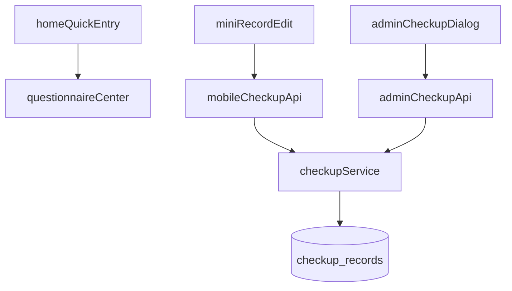

# DESIGN_问卷入口与舌诊扩展

## 1. 总体方案
- 首页快捷区新增“问卷中心”按钮，使用 `switchTab` 进入问卷中心
- 后端检测记录模型扩展三项舌诊字段
- 小程序记录档案页与后台检测记录弹窗同步接入三项舌诊字段

## 2. 数据流

## 3. 模型字段
- `checkup_records.tongue_shape`
- `checkup_records.tongue_color`
- `checkup_records.tongue_coating`

## 4. 关键实现点
- `core.js` 中新增表字段并通过 `ensureColumn` 兼容旧库
- `checkupService.js` 统一完成：
  - 标准化输出
  - 标准化输入
  - 新增 SQL
  - 更新 SQL
- 小程序和后台表单复用与档案管理一致的选项值
