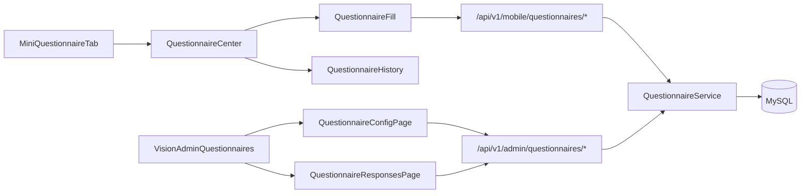

# DESIGN_问卷系统新增

## 一、总体设计

## 二、数据设计

### 2.1 结构化年级字段

- `school_classes.grade_name`
- `children.grade_name`

### 2.2 问卷核心表

| 表名 | 用途 |
| --- | --- |
| `questionnaires` | 问卷主表 |
| `questionnaire_sections` | 分组/分页 |
| `questionnaire_questions` | 题目主表 |
| `questionnaire_question_options` | 选项表 |
| `questionnaire_assignment_rules` | 派发与提交规则 |
| `questionnaire_submissions` | 提交主记录 |
| `questionnaire_answers` | 单题答案明细 |

## 三、接口设计

### 3.1 小程序端

- `GET /api/v1/mobile/questionnaires`
- `GET /api/v1/mobile/questionnaires/:id`
- `POST /api/v1/mobile/questionnaires/:id/draft`
- `POST /api/v1/mobile/questionnaires/:id/submit`
- `GET /api/v1/mobile/questionnaires/:id/submissions`
- `GET /api/v1/mobile/questionnaire-submissions/:submissionId`

### 3.2 管理后台

- `GET /api/v1/admin/questionnaires`
- `GET /api/v1/admin/questionnaires/:id`
- `POST /api/v1/admin/questionnaires`
- `PUT /api/v1/admin/questionnaires/:id`
- `DELETE /api/v1/admin/questionnaires/:id`
- `POST /api/v1/admin/questionnaires/:id/copy`
- `PUT /api/v1/admin/questionnaires/:id/status`
- `GET /api/v1/admin/questionnaire-submissions`
- `GET /api/v1/admin/questionnaire-submissions/:submissionId`
- `GET /api/v1/admin/questionnaire-submissions/export`

## 四、页面设计

### 4.1 小程序端

| 页面 | 用途 |
| --- | --- |
| `pages/questionnaire/index/index` | 问卷中心 |
| `pages/questionnaire/detail/index` | 问卷详情与规则说明 |
| `pages/questionnaire/fill/index` | 动态题目填写 |
| `pages/questionnaire/history/index` | 历史提交与答卷详情 |

### 4.2 管理后台

| 页面 | 用途 |
| --- | --- |
| `src/views/vision-admin/questionnaires/index.vue` | 配置问卷、分组、题目、派发规则 |
| `src/views/vision-admin/questionnaire-responses/index.vue` | 查看提交列表、详情与导出 |
