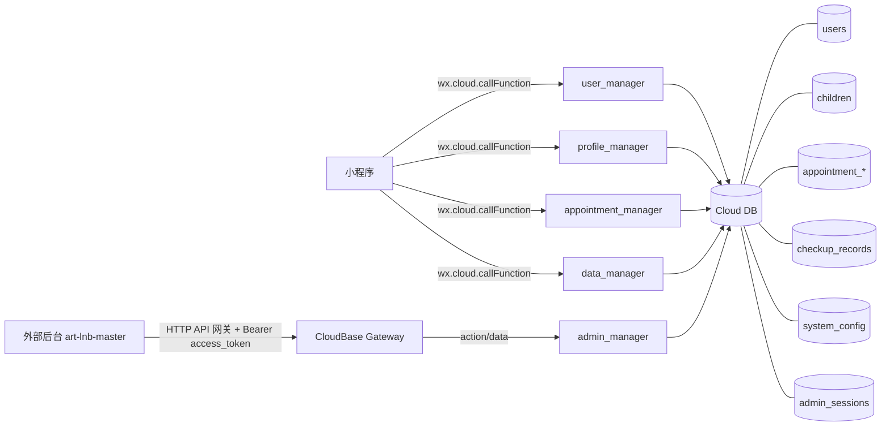

# DESIGN_admin_backend_fix

## 1. 总体架构（mermaid）

## 2. 核心数据流设计

### 2.1 小程序手机号登录（不串号主路径）

- **登录**
  - `MP -> user_manager.login_phone(phone,password)`
  - 返回 `user`（含 `_id`），小程序写入 `wx.setStorageSync('current_user_id', user._id)`
  - 云函数侧更新 `users.last_login_at/updated_at`（并绑定 `_openid`）
- **后续业务请求**
  - 小程序调用任意业务云函数时，统一携带 `user_id`（来自 `App.getCloudUserContext()`）
  - 云函数内部以 `user_id -> users.phone`，并以 `phone` 做数据归属查询（`children.parent_phone`、`appointment_records.phone` 等）

### 2.2 OPENID 回退（缺少 user_id 时）

目的：减少“同 OPENID 下多账号随机命中旧账号”的不确定性。

- 在 `user_manager.get_user_info/get_profile` 中：
  - 若无 `user_id`，通过 `_openid` 查询 `users` 列表后，在云函数内按 `last_login_at/updated_at/created_at` 选择最新账号。

### 2.3 孩子档案更新安全策略

- `profile_manager.update`：
  - 若更新已有孩子（传 `_id`），先读取旧记录并校验归属：
    - 携带 `user_id`：仅允许 `children.parent_phone === users.phone`
    - 未携带 `user_id`：允许 `children._openid === OPENID` 或手机号匹配（兼容模式）
  - 不通过则拒绝写库，避免跨账号误改导致“串号扩大化”。

### 2.4 协议与隐私配置

- **后台编辑**
  - `WEB -> admin_manager.system_config_terms_get/update`（需 `admin_sessions.token`）
  - 持久化到 `system_config (key=terms_and_privacy)`
- **小程序读取**
  - 登录页 `MP -> data_manager.terms_get`（只读公开接口）
  - 云函数读取 `system_config`，若不存在则返回默认结构，保证 UI 可正常渲染。

## 3. 接口契约（关键）

### 3.1 小程序云函数通用入参（建议）

- `event.user_id?: string`（强烈建议携带）
- `event.action: string`
- `event.data?: object`

### 3.2 后台云函数通用入参

- `event.action: string`
- `event.data.token: string`（除 `admin_login` 外必带）

## 4. 异常处理策略

- **缺少 user_id**：允许回退 OPENID，但尽量选“最近登录账号”；对需要强隔离的写操作增加归属校验。
- **token 无效/过期**：`admin_manager` 返回失败，前端按现有逻辑处理退出/重新登录。

