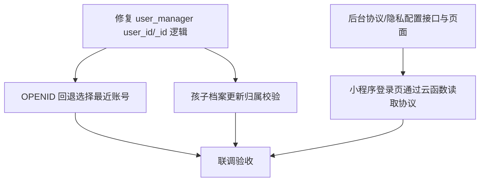

# TASK_admin_backend_fix

## 任务拆分（原子化）

## 原子任务清单

### T1. 修复 `user_manager` 在 `user_id` 场景下的 `_id` 处理

- **输入契约**
  - 云函数：`cloudfunctions/user_manager/index.js`
  - 触发：`get_user_info/get_profile/update_profile/bootstrap_admin/set_admin_by_user_no`
- **输出契约**
  - `doc(user_id).get()` 读取成功时，返回的 `user._id === user_id`
  - `update_profile` 使用正确的 doc id 更新
- **验收标准**
  - 以上接口携带 `user_id` 时不再出现 `_id: undefined` 或 doc 更新到 `undefined`

### T2. OPENID 回退时选“最近登录账号”

- **输入契约**
  - `users` 可能存在多条 `_openid` 相同的记录
- **输出契约**
  - `login_phone` 更新 `last_login_at/updated_at`
  - OPENID 回退查询在云函数内按 `last_login_at/updated_at/created_at` 选最新
- **验收标准**
  - 同 OPENID 下多账号，微信登录默认进入最近登录账号

### T3. `profile_manager.update` 增加归属校验

- **输入契约**
  - 更新孩子档案请求携带 `user_id`（或仅 OPENID）
- **输出契约**
  - 非归属账号更新时返回失败，不落库
- **验收标准**
  - A 账号无法修改 B 账号孩子档案

### T4. 后台“协议与隐私”可配置

- **输入契约**
  - 云函数：`cloudfunctions/admin_manager/index.js`
  - 前端：`art-lnb-master` 路由 + API + 页面
- **输出契约**
  - `system_config_terms_get/update` 可用
  - 后台页面可编辑四段内容并保存
- **验收标准**
  - 保存后刷新仍能读到最新内容

### T5. 小程序登录页通过云函数读取协议

- **输入契约**
  - `data_manager` 增加 `terms_get`
  - 小程序登录页 `fetchTerms()` 调用云函数
- **输出契约**
  - 在数据库权限受限时也能加载协议内容
- **验收标准**
  - 关闭数据库直读权限后，登录页仍能展示协议内容

