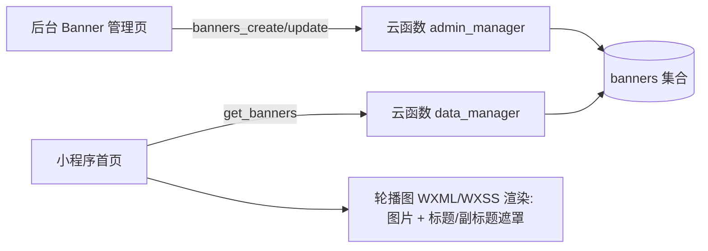

# DESIGN_banner_dashboard_fix

## 1. 总体方案概览

本任务包含两条独立但相关的改动链路：

1) **看板页宽度修复**：页面局部覆写 `.container` 的 `align-items`，让内容与首页一致全宽拉伸。
2) **轮播图主/副标题**：扩展 `banners` 数据模型与后台表单，云函数校验写入，小程序首页叠加展示。

## 2. 数据模型设计

### 2.1 `banners` 集合字段（新增）

- `image_url: string`（已有）
- `title: string`（新增，可选，最多 30 字）
- `sub_title: string`（新增，可选，最多 60 字）
- `order: number`（已有）
- `active: boolean`（已有）
- `created_at/updated_at`（已有）

兼容性：历史 banner 无 `title/sub_title` 字段时，小程序端不展示文字层。

## 3. 接口契约（云函数）

### 3.1 `admin_manager`

- `banners_create`
  - 入参：`{ image_url, title?, sub_title?, order, active? }`
  - 校验：
    - `image_url` 必填；禁止 `/pages/...` 页面路径
    - `title.length <= 30`
    - `sub_title.length <= 60`
  - 写入：新增文档包含 `title/sub_title`

- `banners_update`
  - 入参：`{ _id, patch: { image_url?, title?, sub_title?, order?, active? } }`
  - 校验同上（对 patch 中出现的字段生效）
  - 写入：更新对应字段并刷新 `updated_at`

### 3.2 `data_manager`

- `get_banners`
  - 返回：`{ success: true, list: BannerDoc[] }`（BannerDoc 含 `title/sub_title`）
  - 过滤：服务端过滤明显不合法图片地址（`/pages/...`）

## 4. 前端展示设计

### 4.1 小程序首页轮播图展示

- WXML：在 `swiper-item` 内包裹一个相对定位容器，叠加遮罩层与文字层。
- WXSS：渐变遮罩（底部加深），白色标题/副标题文本（仅当字段有值时展示）。

### 4.2 看板页宽度修复

- 在 `miniprogram/pages/dashboard/index/index.wxss` 的 `.container` 中覆写：
  - `align-items: stretch;`
- 目的：覆盖全局 `.container align-items:center`，与首页策略一致。

## 5. 数据流（mermaid）

## 6. 异常处理策略

- **无效图片地址**：服务端过滤 `/pages/...`；后台新增/更新校验拦截并返回明确错误。
- **标题缺失**：小程序端 `wx:if` 控制，仅有值才渲染对应文本与遮罩。
- **cloud:// FileID**：小程序端通过 `wx.cloud.getTempFileURL` 转临时 URL；失败则该 banner 不展示（保持页面可用）。

