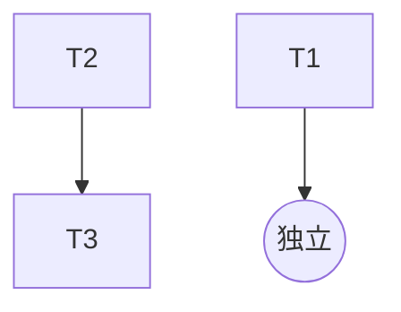

# TASK_banner_dashboard_fix

## 任务拆分（原子化）

### T1. 看板页宽度与首页一致

- **输入契约**
  - 已存在全局 `.container`（`app.wxss`）为 flex 容器且默认 `align-items:center`
  - 看板页存在局部 `.container` 样式文件：`miniprogram/pages/dashboard/index/index.wxss`
- **输出契约**
  - 看板页 `.container` 覆写 `align-items: stretch;`
  - 视觉上内容宽度与首页一致
- **验收标准**
  - 看板页 hero/card/列表等不再“变窄”

### T2. 后台轮播图支持主/副标题字段

- **输入契约**
  - 云函数：`cloudfunctions/admin_manager/index.js` 已有 `banners_create/banners_update`
  - 管理端页面：`art-lnb-master/src/views/vision-admin/banners/index.vue`
  - 管理端 API：`art-lnb-master/src/api/vision-admin.ts`
- **输出契约**
  - 云函数新增字段校验与写入：`title`（<=30）、`sub_title`（<=60）
  - 管理端表单新增两个输入项并在列表中展示
- **验收标准**
  - 新增/编辑 banner 可保存主/副标题且能在列表中看到

### T3. 小程序首页轮播图展示主/副标题

- **输入契约**
  - 小程序首页已通过 `data_manager.get_banners` 拉取 banner 列表
  - 首页轮播 WXML/WXSS 可改造
- **输出契约**
  - WXML：新增遮罩/文字层，字段有值才展示
  - WXSS：遮罩渐变 + 标题/副标题样式
  - 首页 `onShow` 刷新轮播数据（便于后台改完立即看到）
- **验收标准**
  - 后台保存标题后，小程序首页轮播图能看到对应主/副标题

## 依赖关系

