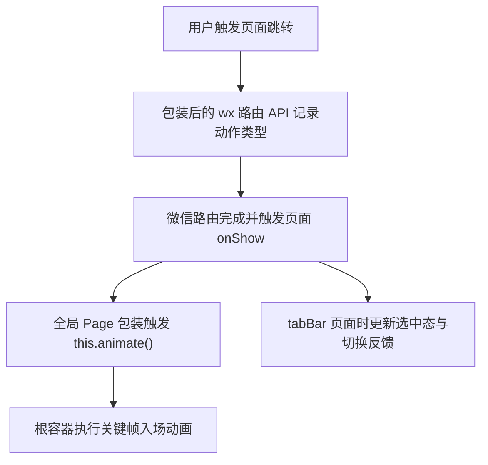

# DESIGN_global_page_transition_motion

## 1. 设计目标
- 在不改动现有页面业务逻辑的前提下，为全站建立统一且有辨识度的页面切换动效。
- 使用最少的代码侵入覆盖最多的页面路径。

## 2. 方案设计

### 2.1 全局路由动作采集
- 在 `app.js` 中包装以下 API：
  - `wx.navigateTo`
  - `wx.redirectTo`
  - `wx.reLaunch`
  - `wx.switchTab`
  - `wx.navigateBack`
- 每次调用时记录最近一次路由类型和时间戳。

### 2.2 页面入场动效执行
- 在全局 `Page` 包装逻辑中：
  - 保留现有 `page_view` 埋点
  - 在页面 `onShow` 后触发统一入场动画
- 动画执行目标：
  - 优先选择 `.container`
  - 若页面不使用 `.container`，则回退到 `.page`

### 2.3 路由类型对应的动效语言
- `navigateTo`：
  - 从下方轻浮入场
  - 带轻微放大回弹
- `redirectTo`：
  - 更直接、更干净的淡入上浮
- `switchTab`：
  - 更稳的垂直浮入，避免过强方向感
- `navigateBack`：
  - 从左侧轻推回归，弱化“瞬间闪回”
- `reLaunch`：
  - 更完整的淡入缩放，强化“重新进入主场景”的感觉

### 2.4 视觉辅助层
- 在 `app.wxss` 中增加：
  - 页面根节点 fallback 动画
  - 常见容器的 `will-change`
  - 统一点击反馈与阴影过渡
  - 顶层子元素的分层浮现

### 2.5 tabBar 动效
- 在自定义 `tabBar` 中增加：
  - 当前选中项图标/文本的轻微上浮与缩放
  - 点击时的短暂 pulse 动效
  - 柔和的选中背景层

## 3. 数据流与执行流

## 4. 风险控制
- 若页面实例不存在 `animate` 能力，则保留 `app.wxss` fallback 动画。
- 动画时长控制在 320ms - 520ms，避免拖沓。
- 仅对根容器做统一关键帧处理，避免逐节点重动画导致卡顿。
