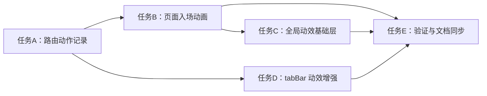

# TASK_global_page_transition_motion

## 1. 原子任务拆分

### 任务 A：实现全局路由动作记录
- 输入契约：
  - 文件：`miniprogram/app.js`
- 输出契约：
  - 路由 API 被统一包装
  - 可区分最近一次跳转类型
- 实现约束：
  - 不破坏原有 API 入参和返回行为

### 任务 B：实现页面统一入场动画
- 输入契约：
  - 文件：`miniprogram/app.js`
  - 依赖：官方 `this.animate()` 能力
- 输出契约：
  - 页面 `onShow` 时自动执行对应动画
  - 兼容 `.container` 与 `.page` 两类根容器
- 实现约束：
  - 保留原有埋点逻辑
  - 动画失败时静默降级

### 任务 C：增强全局视觉动效基础层
- 输入契约：
  - 文件：`miniprogram/app.wxss`
- 输出契约：
  - 全局页面 fallback 动画升级
  - 常见容器和按钮的过渡更柔和
- 实现约束：
  - 不破坏现有页面布局

### 任务 D：增强自定义 tabBar 动效
- 输入契约：
  - 文件：`miniprogram/custom-tab-bar/index.js`
  - 文件：`miniprogram/custom-tab-bar/index.wxml`
  - 文件：`miniprogram/custom-tab-bar/index.wxss`
- 输出契约：
  - tab 切换反馈更明显
  - 选中态更灵动
- 实现约束：
  - 不影响现有 tab 跳转逻辑

### 任务 E：验证与文档同步
- 输入契约：
  - 上述改动已完成
- 输出契约：
  - 完成静态检查
  - 补齐 ACCEPTANCE、FINAL、TODO
  - 更新 `说明文档.md`

## 2. 依赖关系
- 任务 A -> 任务 B -> 任务 C
- 任务 A -> 任务 D
- 任务 B、C、D -> 任务 E

## 3. 任务依赖图

