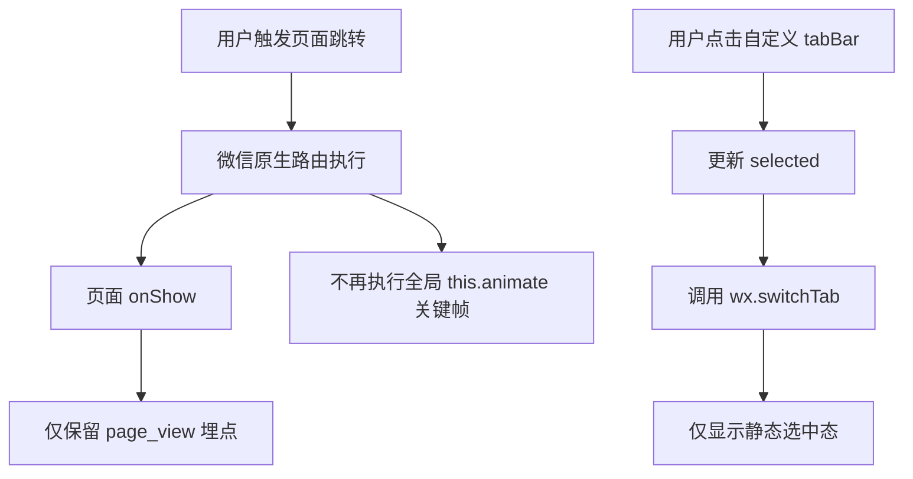

# DESIGN_global_page_transition_remove

## 1. 方案概述
- 本次采用“删除全局转场入口 + 删除全局样式动画 + 简化 tab 切换反馈”的直接回退方案。
- 方案目标是恢复页面跳转的直接显示效果，避免保留任何跨页回弹残留。

## 2. 整体流程图

## 3. 模块设计

### 3.1 `miniprogram/app.js`
- 删除最近一次路由动作类型记录。
- 删除页面根容器入场动画执行逻辑。
- 保留全局 `Page` 包装中的页面访问埋点逻辑。

### 3.2 `miniprogram/app.wxss`
- 删除 `pageRevealSoft` 页面级入场动画。
- 删除 `sectionFloatIn` 容器子节点分层动画。
- 保留全局基础布局和通用按钮样式。

### 3.3 `miniprogram/custom-tab-bar/*`
- 删除 `pulse` 状态字段与触发逻辑。
- 删除依赖位移、缩放、关键帧的视觉反馈。
- 保留静态选中颜色、轻量高亮和透明度反馈。

## 4. 异常处理策略
- 不改动业务逻辑、页面路径和接口调用，降低功能回归风险。
- 不引入新的异步状态和全局开关，避免后续维护混乱。
- 若微信开发者工具中仍感知到页面动效，优先继续排查页面私有样式，而不是回退本次全局清理结果。
