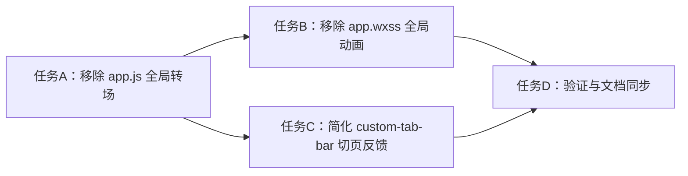

# TASK_global_page_transition_remove

## 1. 原子任务拆分

### 任务 A：移除全局页面入场动画逻辑
- 输入契约：
  - 文件：`miniprogram/app.js`
- 输出契约：
  - 删除全局路由动作记录
  - 删除 `this.animate()` 页面入场调用
  - 保留 `page_view` 埋点
- 实现约束：
  - 不影响现有页面生命周期逻辑

### 任务 B：移除全局样式层的跨页浮入动画
- 输入契约：
  - 文件：`miniprogram/app.wxss`
- 输出契约：
  - 删除页面级 fallback 动画
  - 删除容器子节点分层浮入动画
- 实现约束：
  - 不破坏页面基础布局

### 任务 C：移除主导航切页弹性反馈
- 输入契约：
  - 文件：`miniprogram/custom-tab-bar/index.js`
  - 文件：`miniprogram/custom-tab-bar/index.wxml`
  - 文件：`miniprogram/custom-tab-bar/index.wxss`
- 输出契约：
  - 删除 pulse 状态与关键帧动画
  - 删除抬升、缩放类切换反馈
- 实现约束：
  - 不影响 `switchTab` 路由行为

### 任务 D：验证与文档同步
- 输入契约：
  - 上述改动已完成
- 输出契约：
  - 完成静态检查
  - 新建任务文档集
  - 更新 `说明文档.md`

## 2. 依赖关系
- 任务 A -> 任务 B
- 任务 A -> 任务 C
- 任务 B、C -> 任务 D

## 3. 任务依赖图

