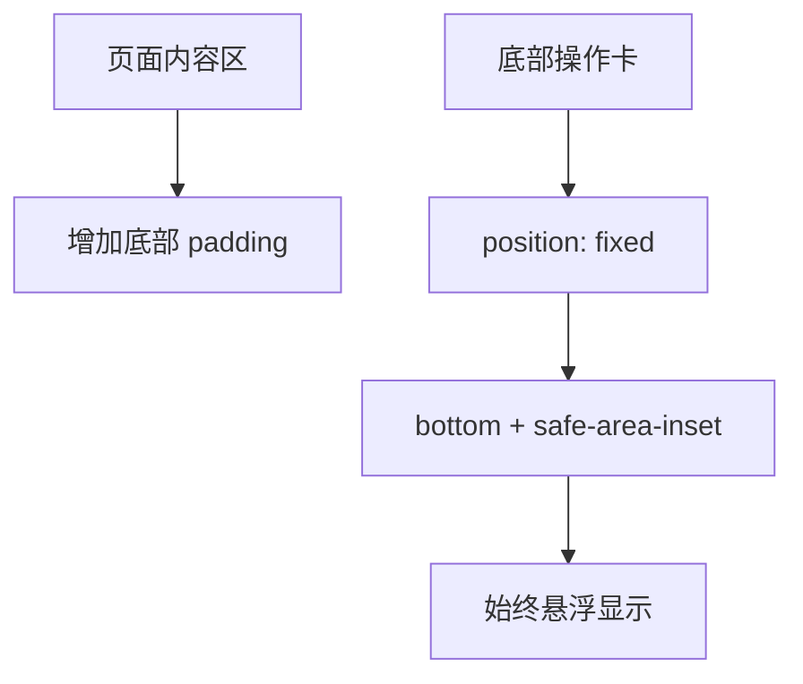

# DESIGN_questionnaire_actionbar_float

## 1. 方案概述
- 将两个页面的底部操作卡改为固定悬浮布局
- 内容区通过增大 `padding-bottom` 预留空间
- 操作卡使用半透明白底、圆角、阴影，保持与现有卡片风格一致

## 2. 页面设计

### 2.1 详情页
- 固定底部操作卡：
  - `查看历史`
  - `开始填写 / 继续填写`
- 内容区底部预留：
  - 足够容纳悬浮卡 + 安全区

### 2.2 填写页
- 固定底部操作卡：
  - 第一行：`上一页` / `下一页`
  - 第二行：`保存草稿` / `提交问卷`
- 内容区底部预留：
  - 足够容纳双行按钮卡 + 安全区

## 3. 布局策略

## 4. 风险控制
- 固定卡片可能遮挡内容：
  - 通过额外 `padding-bottom` 规避
- 不同设备底部安全区差异：
  - 使用 `env(safe-area-inset-bottom)` 兼容
