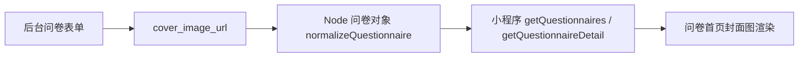

# DESIGN_questionnaire_cover_contrast_fix

## 1. 总体方案

### 1.1 问卷首页封面展示
- 在问卷卡片顶部增加封面图区域
- 封面图展示规则：
  - 有 `cover_image_url`：显示封面大图
  - 无 `cover_image_url`：继续使用原图标卡头布局
- 封面图区域叠加轻量遮罩与状态标签，保证信息仍可识别

### 1.2 详情页 / 填写页顶部可读性优化
- 将 hero 区改为更稳定的深蓝渐变
- 提高 `hero-kicker`、`tag`、`hero-icon-wrap` 的底色和边框对比
- 将右上角图标替换为白色版问卷图标
- 为标题和关键文本增加轻量阴影，提升可读性

## 2. 页面设计

### 2.1 问卷首页问卷卡
- 顶部：封面图区域
- 下方：标题、简介、规则、统计、按钮
- 封面图区域显示：
  - 状态标签
  - 封面图本身

### 2.2 Hero 区
- 适用于：
  - `detail/index`
  - `fill/index`
- 优化点：
  - 字更亮
  - 底色更稳
  - 图标改白
  - 半透明标签更清楚

## 3. 数据流

## 4. 风险控制
- 封面图不存在：
  - 自动回退到原图标布局
- 顶部颜色过深：
  - 保持原蓝色系，只收紧亮度和透明度，不改品牌主色
