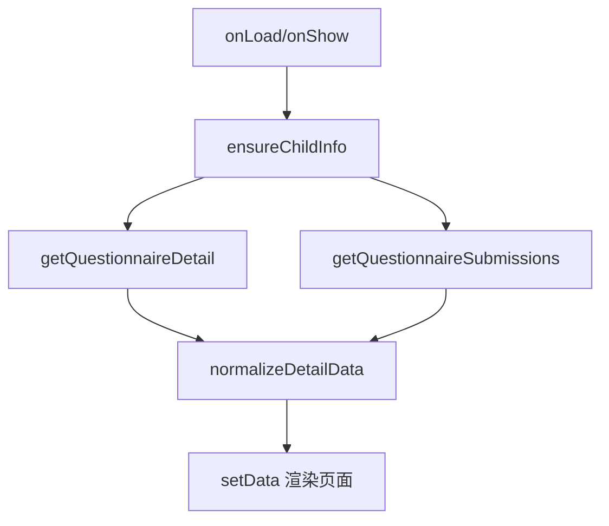

# DESIGN_questionnaire_detail_refactor

## 1. 总体方案
- 顶部采用蓝色渐变英雄区，承载标题、简介、状态标签
- 内容区分为 4 个主要模块：
  - 填写对象卡
  - 结构概览卡
  - 问卷结构列表卡
  - 填写记录与底部操作卡
- JS 层统一生成展示字段，WXML 仅负责渲染

## 2. 页面模块设计

### 2.1 顶部英雄区
- 字段：
  - `questionnaire.title`
  - `questionnaire.description`
  - `statusText`
  - `remainingText`
- 样式：与问卷首页对齐的渐变头图、轻量标签、右侧图标块

### 2.2 填写对象卡
- 展示孩子姓名、学校、年级、班级
- 展示派发规则和提交规则
- 强化“当前填写对象”语义

### 2.3 结构概览卡
- 展示总页数、总题数、历史提交数
- 用于帮助用户进入填写前快速理解问卷规模

### 2.4 结构列表卡
- 每一页/每个 section 独立展示
- 展示页码、标题、说明、题目数

### 2.5 记录与操作卡
- 展示草稿情况、历史提交情况
- 展示“查看历史”“开始填写/继续填写”按钮

## 3. 数据流

## 4. 异常处理
- 无孩子档案：展示空状态，引导完善档案
- 加载中：展示统一 loading state
- 接口失败：toast 提示并显示空列表/空状态
- 重复 `Page(...)`：通过删除模板残留彻底修复
