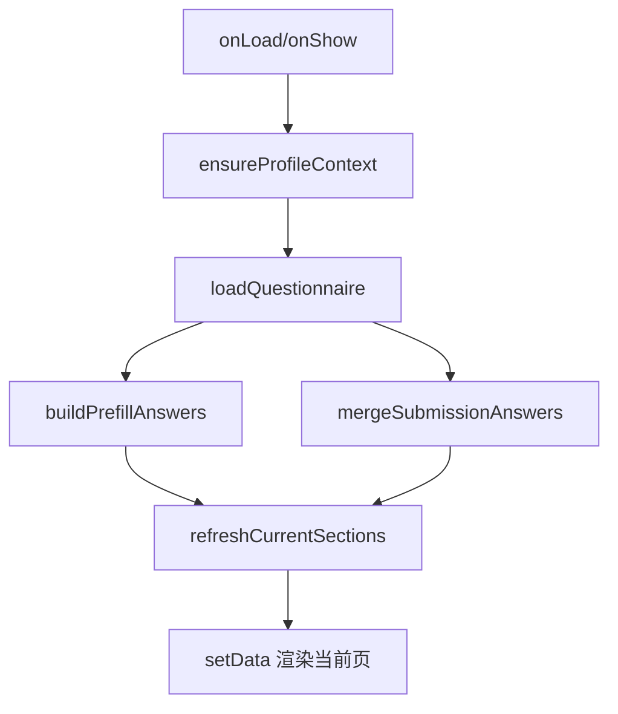

# DESIGN_questionnaire_fill_refactor

## 1. 总体方案
- 顶部使用蓝色渐变英雄区，展示标题、页码与填写进度
- 内容区分为三个层级：
  - 当前填写对象摘要卡
  - 当前页分组卡
  - 题目卡片列表
- 底部使用操作卡承载分页按钮与提交按钮

## 2. 页面分层设计

### 2.1 顶部英雄区
- 展示：
  - 问卷标题
  - 当前页文案
  - 当前页说明
  - 已填写进度标签
  - 进度条

### 2.2 填写对象卡
- 展示孩子姓名、学校、年级、班级
- 表达“当前填写对象”与“草稿状态”

### 2.3 分组与题目区
- 当前页按 section 渲染
- 每个 section 独立为一张卡
- 每个题目再拆为独立 question card
- 各题型在统一的表单容器样式中展示

### 2.4 底部操作区
- 第一行：上一页 / 下一页
- 第二行：保存草稿 / 提交问卷
- 在无题页或末页保持交互可预期

## 3. 数据流

## 4. 异常处理
- 无问卷 ID：显示空状态提示
- 无孩子档案：显示档案引导
- 接口失败：toast 提示并保留空状态
- 重复 `Page(...)`：删除模板残留彻底修复
