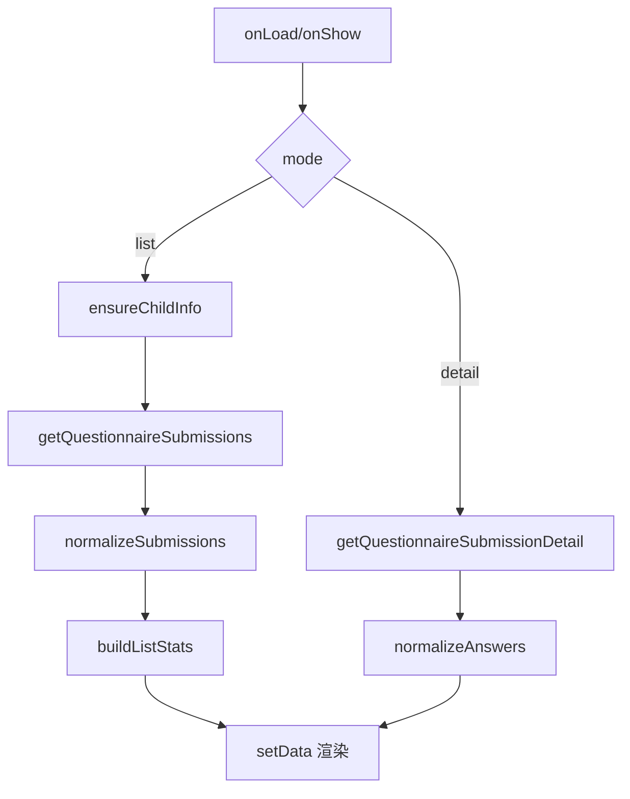

# DESIGN_questionnaire_history_refactor

## 1. 总体方案
- 列表态：
  - 顶部 hero 卡展示当前记录概览
  - 下方展示历史记录卡片列表或空状态
- 详情态：
  - 顶部 hero 卡展示答卷摘要
  - 下方展示答卷基础信息卡和答案列表卡

## 2. 页面模块设计

### 2.1 列表态
- Hero 区：
  - 标题：记录概览
  - 描述：当前孩子的问卷提交和草稿情况
  - 标签：总记录 / 已提交 / 草稿
- 内容区：
  - 记录卡片：提交次数、状态、学生信息、时间、得分、答题数

### 2.2 详情态
- Hero 区：
  - 标题：第 N 次提交 / 草稿
  - 描述：问卷标题或答卷信息
  - 标签：状态 / 答题数 / 得分
- 内容区：
  - 摘要卡：学生、学校、年级、班级、时间、状态
  - 答案卡：题号、题目、答案内容

## 3. 数据流

## 4. 风险控制
- 无孩子档案：展示引导状态
- 无提交记录：展示空状态
- 详情不存在：toast 提示并显示空状态
- 重复 `Page(...)`：通过删除模板残留彻底修复
