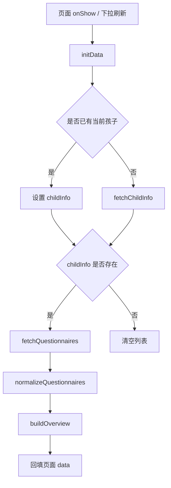
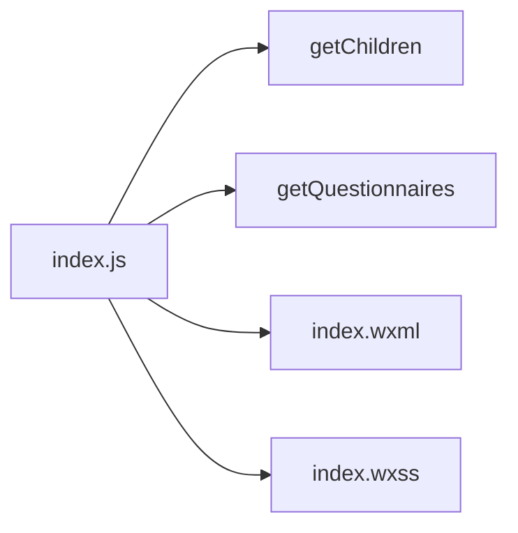

# DESIGN_questionnaire_index_refactor

## 1. 总体方案

本次重构仅针对 `miniprogram/pages/questionnaire/index/index` 页面，采用“与首页、看板页同风格的头图 + 白卡内容区”方案，在不变更主题色和业务流程的前提下，提升页面信息层级与视觉一致性。

## 2. 页面分层设计

### 2.1 顶部英雄区
- 使用蓝色渐变背景，和首页、看板页形成统一记忆点。
- 顶部包含：
  - 页面标题与副标题
  - 主题图标
  - 当前孩子信息卡 / 未绑定孩子引导卡
  - 问卷概览统计区

### 2.2 问卷列表区
- 使用白色卡片承载每份问卷。
- 每张卡片包含：
  - 左侧问卷图标
  - 标题、简介
  - 状态标签
  - 派发规则、提交规则
  - 草稿/已提交/总记录统计
  - 操作按钮（填写记录 / 查看问卷或继续填写）

### 2.3 空状态区
- 无孩子档案时：提示完善档案
- 有孩子但无问卷时：提示当前暂无可填写问卷
- 加载中时：提供统一风格提示卡

## 3. 数据与接口契约

### 3.1 输入数据
- `childInfo`
  - 来源: `getChildren()` 或 `app.globalData.currentChild`
- `questionnaires`
  - 来源: `getQuestionnaires(childId)`

### 3.2 页面派生数据
- `childSummary: string`
- `childInitial: string`
- `overview: { total, draftCount, submittedCount }`
- `questionnaires[].statusText`
- `questionnaires[].ruleName`
- `questionnaires[].submitRuleText`
- `questionnaires[].draftCount`
- `questionnaires[].submittedCount`
- `questionnaires[].recordTotal`
- `questionnaires[].actionText`
- `questionnaires[].actionHint`

## 4. 数据流向

## 5. 接口与模块关系

## 6. 异常处理策略
- `getChildren` 失败：回退为空孩子状态，不中断页面渲染。
- `getQuestionnaires` 失败：清空问卷列表，并提示加载失败。
- 字段缺失：统一在格式化阶段提供默认文案，避免模板层空值分支过多。

## 7. 设计原则
- 风格与 `home/index`、`dashboard/index` 对齐。
- 保持蓝色系，不额外扩张主题色。
- 使用现有图标，不使用 emoji。
- 样式简洁，避免高饱和装饰和过度阴影。
