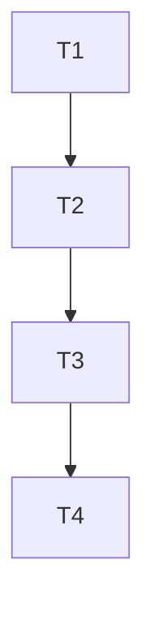

# TASK_questionnaire_index_refactor

## 任务拆分（原子化）

### T1. 建立页面重构任务文档
- **输入契约**
  - 项目已有 `docs/` 目录与既有文档模板
  - 已确认本次任务仅针对问卷首页
- **输出契约**
  - 新建 `ALIGNMENT`、`CONSENSUS`、`DESIGN`、`TASK`
- **验收标准**
  - 文档明确记录范围、约束、方案与任务顺序

### T2. 重构问卷首页展示结构
- **输入契约**
  - 页面文件存在：
    - `miniprogram/pages/questionnaire/index/index.wxml`
    - `miniprogram/pages/questionnaire/index/index.wxss`
- **输出契约**
  - 页面采用统一头图结构
  - 当前孩子信息卡样式升级
  - 问卷列表卡片层次更清晰
- **验收标准**
  - 页面视觉上与首页、看板页更一致
  - 不改变现有交互入口

### T3. 收敛页面展示逻辑
- **输入契约**
  - 页面脚本文件存在：`miniprogram/pages/questionnaire/index/index.js`
- **输出契约**
  - 新增数据格式化方法
  - 模板中复杂表达式减少
  - 函数补齐函数级注释
- **验收标准**
  - WXML 可读性提升
  - 页面仍可正常加载和跳转

### T4. 自检与文档收尾
- **输入契约**
  - 页面代码已修改完成
- **输出契约**
  - 更新 `ACCEPTANCE`、`FINAL`、`TODO`
  - 更新根级 `说明文档.md`
  - 执行最近改动文件静态检查
- **验收标准**
  - 文档与代码状态一致
  - 无新增明显诊断问题

## 依赖关系

