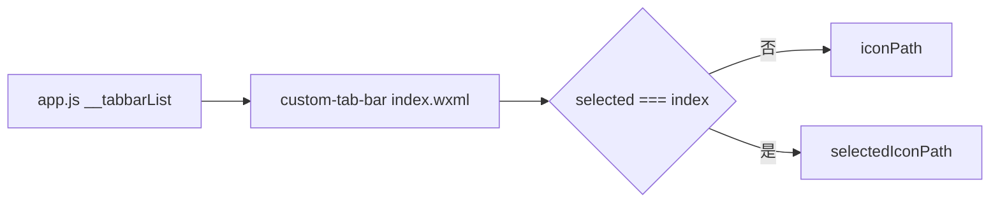

# DESIGN_questionnaire_tab_icon_fix

## 1. 方案概述
- 保留现有自定义 `custom-tab-bar` 结构
- 不修改 `custom-tab-bar/index.wxml` 的切换逻辑
- 仅调整 `app.js` 中“问卷”tab 的图标资源配置
- 新增两份 SVG：
  - `question-tab.svg`
  - `question-tab-active.svg`

## 2. 资源设计
- 普通态：灰色描边 `#8A8A8A`
- 选中态：蓝色描边 `#0077C2`
- 图形：圆圈 + 问号，保持与其他 tab 线性图标风格一致

## 3. 数据流

