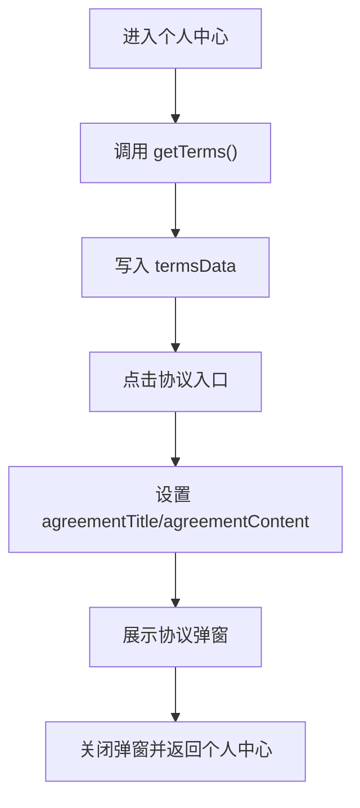

# DESIGN_user_more_features

## 1. 设计目标
- 在不新增页面和后端接口的前提下，扩充个人中心 `更多` 区块的承接能力。
- 让协议查看入口从登录页延伸到个人中心，提升用户二次查阅协议的可达性。

## 2. 结构设计

### 2.1 页面结构
- 目标页面：`miniprogram/pages/user/index`
- 调整内容：
  - `更多` 菜单列表中插入 3 个协议入口
  - 页面底部增加协议内容弹窗

### 2.2 状态设计
- 页面状态新增：
  - `showAgreementModal`
  - `agreementTitle`
  - `agreementContent`
  - `termsData`

### 2.3 交互设计
- 页面加载时调用 `getTerms()` 获取后台协议配置。
- 点击某个协议入口时：
  - 根据入口类型设置标题
  - 从 `termsData` 读取正文
  - 打开弹窗展示内容
- 点击遮罩或按钮时关闭弹窗。

## 3. 数据流

## 4. 技术约束
- 不新增后端接口。
- 不新增独立协议页面。
- 保持当前个人中心蓝白卡片风格。
- 协议内容展示采用弹窗滚动区域，避免页面跳转层级增加。

## 5. 异常处理
- `getTerms()` 失败时保留默认占位文案，确保入口仍可点击。
- 当后台某项协议为空时，统一回退为 `暂无内容`，避免空白弹窗。
