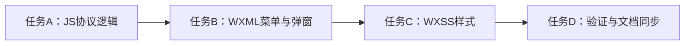

# TASK_user_more_features

## 1. 原子任务拆分

### 任务 A：补齐协议展示状态与方法
- 输入契约：
  - 目标文件：`miniprogram/pages/user/index/index.js`
  - 依赖：现有 `getTerms()` 接口可用
- 输出契约：
  - 页面具备协议数据拉取能力
  - 页面具备打开/关闭协议弹窗的方法
- 实现约束：
  - 不影响现有头像、姓名、退出登录逻辑
  - 新增函数需保持命名清晰

### 任务 B：扩展“更多”菜单结构
- 输入契约：
  - 目标文件：`miniprogram/pages/user/index/index.wxml`
- 输出契约：
  - 新增 3 个协议菜单项
  - 新增协议内容弹窗结构
- 实现约束：
  - 保持当前菜单项结构一致
  - 不破坏已有入口点击行为

### 任务 C：补充协议弹窗样式
- 输入契约：
  - 目标文件：`miniprogram/pages/user/index/index.wxss`
- 输出契约：
  - 协议弹窗具备可读、可滚动、可关闭的视觉样式
- 实现约束：
  - 保持页面整体视觉一致
  - 不影响已有姓名编辑弹窗样式

### 任务 D：完成验证与文档同步
- 输入契约：
  - 已完成代码改动
- 输出契约：
  - 静态检查完成
  - 验收、总结、待办文档补齐
- 实现约束：
  - 必须同步更新 `说明文档.md`

## 2. 依赖关系
- 任务 A -> 任务 B -> 任务 C -> 任务 D

## 3. 任务依赖图

