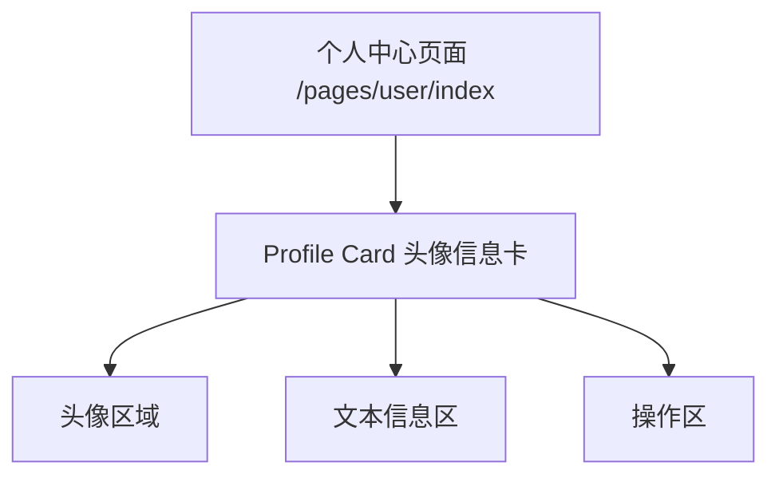

# DESIGN_user_profile_card_refactor: 个人中心头像信息卡大厂风重构

## 1. 整体架构图（局部）

## 2. 分层设计与核心组件
- **结构层 (WXML)**: 维持 `profile-card` 结构，仅做最小化结构整理（如有必要）。
- **表现层 (WXSS)**: 统一间距、字号、对齐与卡片容器层级。
- **交互层 (JS)**: 不变，复用现有事件绑定。

## 3. 模块依赖关系
- `miniprogram/pages/user/index/index.wxml`
- `miniprogram/pages/user/index/index.wxss`

## 4. 接口契约定义
- 不新增、不修改数据接口或云函数。
- 现有字段：`avatarUrl`, `childInfo.name`, `userProfile.user_no` 继续使用。

## 5. 数据流向图

## 6. 异常处理策略
- 若无 `childInfo.name` 或 `userProfile.user_no`，保持现有占位与条件展示逻辑。
