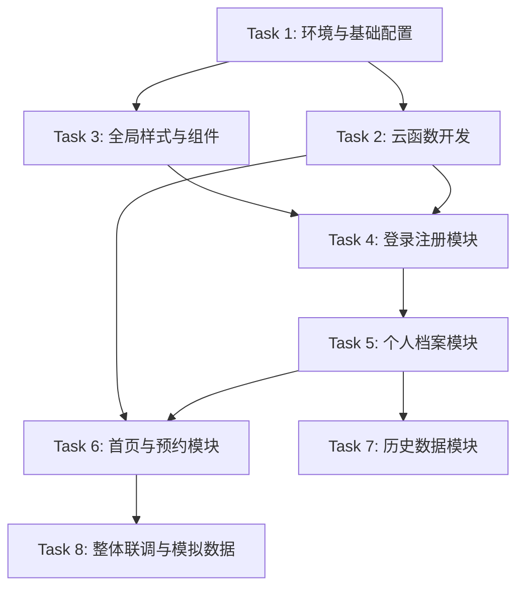

# TASK_vision_app: 任务拆分与执行计划

## 1. 任务依赖图

## 2. 详细任务列表

### Task 1: 环境与基础配置
- **目标**: 初始化项目配置，创建数据库集合。
- **操作**:
  - 创建集合: `users`, `children`, `appointment_items`, `appointment_schedules`, `appointment_records`, `checkup_records`, `banners`.
  - 配置 `app.wxss` 定义 CSS 变量。
  - 清理默认模板代码 (可选).

### Task 2: 云函数开发
- **目标**: 实现核心后端逻辑。
- **子任务**:
  - `user_manager`: 实现 `register`, `login_phone`。
  - `profile_manager`: 实现 `get`, `update`。
  - `appointment_manager`: 实现 `get_items`, `get_schedules`, `book` (含重复预约校验).
  - `data_manager`: 实现 `get_banners`, `get_records`。

### Task 3: 全局样式与组件
- **目标**: 统一 UI 风格。
- **操作**:
  - 在 `app.wxss` 写入配色变量。
  - 封装通用 Button, Input 样式 (如果需要).

### Task 4: 登录注册模块
- **目标**: 实现用户认证。
- **页面**: `pages/auth/login`
- **功能**:
  - 手机号+密码表单。
  - 协议勾选校验。
  - 登录/注册切换。
  - 登录成功后跳转逻辑 (检查档案是否完善).

### Task 5: 个人档案模块
- **目标**: 完善孩子信息。
- **页面**: `pages/profile/edit`
- **功能**:
  - 必填项/选填项表单。
  - 自动加载已有数据。
  - 提交后跳转首页。

### Task 6: 首页与预约模块
- **目标**: 首页展示与核心业务。
- **页面**: `pages/home/index`
- **功能**:
  - 轮播图展示 (从 DB 读取).
  - 预约卡片: 项目下拉 -> 时间下拉 -> 提交.
  - 数据看板卡片: 展示最近一次视力概况，点击跳转。

### Task 7: 历史数据模块
- **目标**: 数据展示与对比。
- **页面**: `pages/history/list`
- **功能**:
  - 列表展示历次检测数据。
  - 对比逻辑 (箭头标识上升/下降).

### Task 8: 整体联调与模拟数据
- **目标**: 验证完整流程。
- **操作**:
  - 往 DB 插入测试用的 Banners, Appointment Items/Schedules, Checkup Records.
  - 测试完整路径: 注册 -> 填档案 -> 首页 -> 预约 -> 查看历史。
